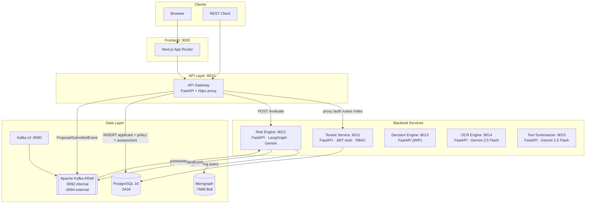
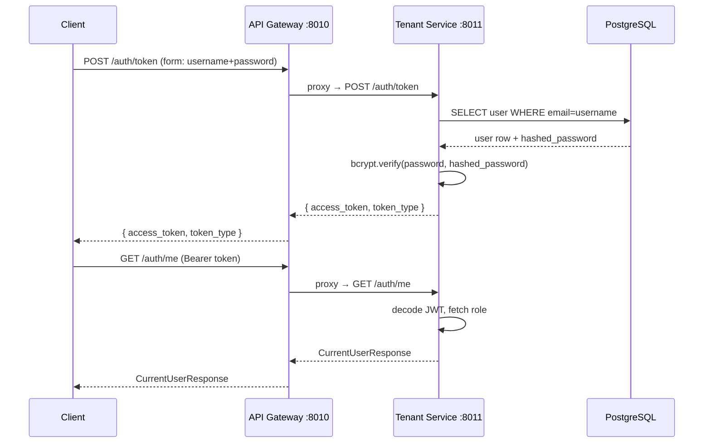

# Architecture

## System diagram

All containers share a single Docker bridge network `insurance-net`. Named volumes (`postgres-data`, `memgraph-data`, `kafka-data`) persist data across container restarts.

## Multi-tenancy

Every table in PostgreSQL carries a `tenant_id` foreign key that scopes all reads and writes to a single insurance company. The Tenant Service issues tenants and JWT tokens; the API Gateway forwards `Authorization: Bearer <token>` to downstream services.

## Service responsibilities

| Service | Responsibility |
|---|---|
| **API Gateway** | Single public entrypoint. Routes `/auth`, `/users`, `/roles` to Tenant Service via httpx proxy. Calls Risk Engine directly for `/evaluate`. Owns the PostgreSQL writes for applicant, policy, and risk_assessment rows. |
| **Tenant Service** | Manages `tenants`, `users`, and `roles` tables. Issues and validates JWT tokens. Seeds four RBAC roles on startup: `Admin`, `Underwriter`, `Agent`, `Viewer`. |
| **Risk Engine** | Runs the LangGraph underwriting workflow (medical scoring → financial scoring → fraud detection → decision aggregation). Reads/writes the Memgraph fraud graph. Publishes `RiskEvaluatedEvent` to Kafka. |
| **OCR Engine** | Accepts PDF/image file uploads and extracts structured text using Gemini 2.5 Flash multimodal. Supports streaming via SSE. |
| **Text Summarizer** | Receives OCR-extracted text (one or more documents) and generates structured Markdown summaries via Gemini 2.5 Flash. |
| **Decision Engine** | Placeholder — will house deterministic rule execution and audit logging. |

## Authentication flow

