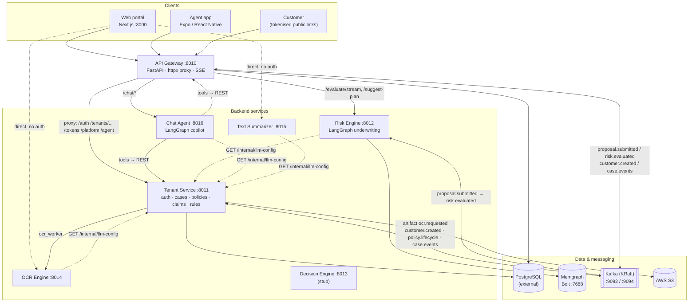
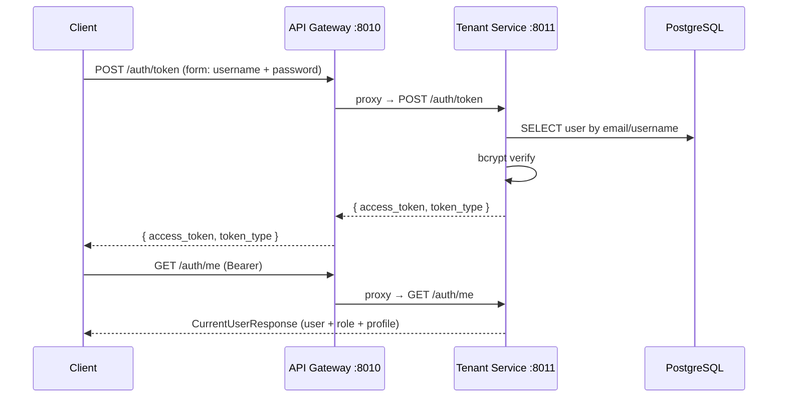

# Architecture

## System diagram

```mermaid
graph TB
    subgraph Clients
        B["Web portal<br/>Next.js :3000"]
        APP["Agent app<br/>Expo / React Native"]
        CUST["Customer<br/>(tokenised public links)"]
    end

    GW["API Gateway :8010<br/>FastAPI · httpx proxy · SSE"]

    subgraph "Backend services"
        TS["Tenant Service :8011<br/>auth · cases · policies · claims · rules"]
        RE["Risk Engine :8012<br/>LangGraph underwriting"]
        CA["Chat Agent :8016<br/>LangGraph copilot"]
        OCR["OCR Engine :8014"]
        SUMM["Text Summarizer :8015"]
        DE["Decision Engine :8013<br/>(stub)"]
    end

    subgraph "Data & messaging"
        PG[("PostgreSQL<br/>(external)")]
        MG[("Memgraph<br/>Bolt :7688")]
        KF[["Kafka (KRaft)<br/>:9092 / :9094"]]
        S3[("AWS S3")]
    end

    B --> GW
    APP --> GW
    CUST --> GW
    B -.->|direct, no auth| OCR
    B -.->|direct, no auth| SUMM

    GW -->|proxy: /auth /tenants/... /tokens /platform /agent| TS
    GW -->|/evaluate/stream, /suggest-plan| RE
    GW -->|/chat/*| CA
    GW --> PG
    GW <-->|proposal.submitted / risk.evaluated<br/>customer.created / case.events| KF

    CA -->|tools → REST| GW
    CA -->|tools → REST| TS
    TS --> PG
    TS --> S3
    TS <-->|artifact.ocr.requested<br/>customer.created · policy.lifecycle · case.events| KF
    TS -->|ocr_worker| OCR
    RE <-->|proposal.submitted → risk.evaluated| KF
    RE --> MG

    RE -.->|GET /internal/llm-config| TS
    CA -.->|GET /internal/llm-config| TS
    OCR -.->|GET /internal/llm-config| TS
    SUMM -.->|GET /internal/llm-config| TS
```

All containers share the Docker bridge network `insurance-net`. Named volumes `memgraph-data` and `kafka-data` persist data; PostgreSQL is external.

## Service responsibilities

| Service | Responsibility |
|---|---|
| **API Gateway** | Single public entry point. Proxies the tenant-service domains (auth, users, customers, cases, policies, claims, rules, …) with the caller's `Authorization`/`X-Tenant-Id`. Owns underwriting (`/evaluate`, `/evaluate/stream`, `/assessments`), quotation (`/quote`, `/quotes`), plan suggestion, the chat proxy, and the live case-event stream (`/events/stream`). Runs three Kafka background workers (below). |
| **Tenant Service** | System of record for tenants, branches, users/roles, customers, families, organisations, insurance plans, cases, pre-underwriting gates, policies (issuance, pre/post-issuance, renewals, reinsurance), claims, the configurable rule engine, global search, LLM provider config, and token-usage accounting. Runs DB migrations at startup and the OCR worker. |
| **Risk Engine** | LangGraph underwriting workflow (validate → profile → medical ‖ financial ‖ fraud → rule-based decision). Consumes `proposal.submitted`, publishes `risk.evaluated`. Writes customers into the Memgraph fraud graph. Also serves `/suggest-plan`. |
| **Chat Agent** | Conversational copilot: a LangGraph agent with domain-scoped tools that call the gateway, a code-enforced permission gate, guided underwriting/claims journeys, and bulk underwriting. See [AI Copilot](/chat-agent). |
| **OCR Engine** | Multimodal document extraction (`/extract`, streaming, customer-form field extraction, structured text extraction). |
| **Text Summarizer** | Document summaries, category-organised underwriting summaries, and draft underwriter notes. |
| **Decision Engine** | Placeholder — health check only. Decision logic lives in `shared/underwriting/decision_rules.py`, executed inside the Risk Engine. |

## Background workers

| Worker | Runs in | Consumes | Does |
|---|---|---|---|
| `quote_worker` | API Gateway | `insurance.customer.created.v1` | Prices every eligible individual plan and stores `Policy` + `PremiumQuote` rows so quotes are ready immediately |
| `risk_result_worker` | API Gateway | `insurance.risk.evaluated.v1` | Persists the `RiskAssessment` for async `/evaluate` and advances the policy/case (deduped on `correlation_id`) |
| `case_event_hub` | API Gateway | `insurance.case.events.v1` | Broadcasts case events (e.g. `EApplicationSubmitted`) to connected browsers over `GET /events/stream` |
| `ocr_worker` | Tenant Service | `insurance.artifact.ocr.requested.v1` | Downloads the artifact from S3, calls the OCR Engine, writes `ocr_result` / confidence / status |
| Kafka consumer | Risk Engine | `insurance.proposal.submitted.v1` | Runs the workflow and publishes `insurance.risk.evaluated.v1` |

All consumers commit offsets only after a successful DB write (at-least-once). The renewal scheduler (`routers/renewal_scheduler.py`) exists but is currently disabled in `tenant-service/main.py`.

## Shared code (`shared/`)

| Package | Contents |
|---|---|
| `shared/models/core.py` | All SQLModel tables and enums — the single schema every service imports |
| `shared/events/kafka_events.py` | Kafka topic names and event envelopes (producer and consumer share them, preventing contract drift) |
| `shared/underwriting/` | `profile.py` (underwriting profile), `requirements_rules.py` (Requirements Engine), `verification.py` (declared vs. evidenced), `decision_rules.py` (final decision chain), `results.py`, `occupation_hazard.py` |
| `shared/pricing/calculator.py` | Premium math used by `/quote`, the quote worker, and issuance |
| `shared/services/policy_state_machine.py` | The only place a policy status may change; writes the `PolicyEvent` audit trail |

## Multi-tenancy

Every business row carries a `tenant_id`. The Tenant Service issues JWTs (HS256, `JWT_SECRET_KEY`) whose user belongs to one tenant; tenant-scoped routes check the path `tenant_id` against the caller. `SuperAdmin` belongs to the reserved `Platform` tenant and can act across tenants. Memgraph queries are tenant-scoped via the `X-Tenant-Id` header forwarded through the LangGraph state.

### RBAC roles

| Role | Access |
|---|---|
| `SuperAdmin` | Platform level — tenants, branches, tenant admins, LLM configuration, token usage |
| `Admin` | Full access within their own tenant |
| `Underwriter` | Evaluate proposals, review assessments, make decisions |
| `Agent` | Leads, proposals, cases, status tracking |
| `Viewer` | Read-only |

## Authentication flow

```mermaid
sequenceDiagram
    participant C as Client
    participant GW as API Gateway :8010
    participant TS as Tenant Service :8011
    participant PG as PostgreSQL

    C->>GW: POST /auth/token (form: username + password)
    GW->>TS: proxy → POST /auth/token
    TS->>PG: SELECT user by email/username
    TS->>TS: bcrypt verify
    TS-->>GW: { access_token, token_type }
    GW-->>C: { access_token, token_type }

    C->>GW: GET /auth/me (Bearer)
    GW->>TS: proxy → GET /auth/me
    TS-->>C: CurrentUserResponse (user + role + profile)
```

Customer-facing flows (E-Application, medical-exam booking) never log in: they use single-use, hashed, expiring tokens under `/public/...`.
