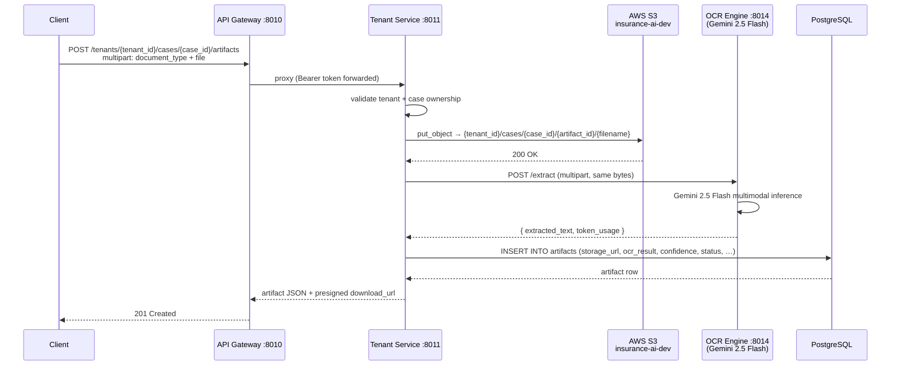

# Artifact Upload & OCR

The artifact system lets users attach physical documents (CNIC scans, salary slips, medical reports, X-rays, policy forms) to a **case** and automatically extract their contents via the **OCR Engine** (Gemini 2.5 Flash). Results are stored in the `artifacts` table and can be retrieved with a fresh presigned download URL at any time.

---

## Upload flow



---

## API endpoints

All three endpoints require a **Bearer token** in the `Authorization` header.

### Upload a document

```
POST /tenants/{tenant_id}/cases/{case_id}/artifacts
Content-Type: multipart/form-data
Authorization: Bearer <token>
```

**Form fields**

| Field | Type | Required | Notes |
|---|---|---|---|
| `document_type` | string | Yes | `CNIC`, `Salary Slip`, `Medical Report`, `X-Ray`, `Policy Form`, etc. |
| `file` | file | Yes | PDF, PNG, JPG, JPEG, TIFF, BMP |

**Example (curl)**

```bash
curl -X POST "http://localhost:8010/tenants/{tenant_id}/cases/{case_id}/artifacts" \
  -H "Authorization: Bearer <token>" \
  -F "document_type=Salary Slip" \
  -F "file=@/path/to/salary_slip.pdf"
```

**Response (201)**

```json
{
  "id": "f08a7fd0-6dd7-40e2-900e-0bdad6875c06",
  "tenant_id": "502e8a32-b3fa-4fce-abdf-19c37c3dd90c",
  "case_id": "3c1a9b77-...",
  "applicant_id": "9d4f2b11-...",
  "uploaded_by": "1a2b3c4d-...",
  "document_type": "Salary Slip",
  "file_name": "salary_slip.pdf",
  "file_size": 204800,
  "file_type": "application/pdf",
  "storage_url": "https://insurance-ai-dev.s3.us-east-1.amazonaws.com/502e8a32.../cases/.../salary_slip.pdf",
  "download_url": "https://insurance-ai-dev.s3.us-east-1.amazonaws.com/...?X-Amz-Signature=...&X-Amz-Expires=3600",
  "ocr_result": "SALARY SLIP\nEmployee: Muhammad Ali Khan\nMonth: May 2026\nBasic Salary: PKR 80,000\nAllowances: PKR 20,000\nNet Pay: PKR 100,000\n...",
  "ocr_confidence_score": 0.9,
  "authenticity_score": 1.0,
  "quality_score": 1.0,
  "tampered_flag": false,
  "status": "Accepted",
  "created_at": "2026-06-24T10:30:00"
}
```

---

### List artifacts for a case

```
GET /tenants/{tenant_id}/cases/{case_id}/artifacts
Authorization: Bearer <token>
```

Returns an array of artifact objects (same shape as above, without fresh presigned URLs).

---

### Get a single artifact

```
GET /tenants/{tenant_id}/artifacts/{artifact_id}
Authorization: Bearer <token>
```

Returns the artifact with a **fresh presigned `download_url`** (1-hour expiry). Use this endpoint whenever you need to re-download a file.

---

## Status logic

| `ocr_confidence_score` | `status` |
|---|---|
| ≥ 0.7 | `Accepted` |
| < 0.7 | `Re-submission Requested` |

Confidence is derived from the OCR output length:

| OCR output length | Score |
|---|---|
| > 200 characters | 0.9 |
| 51 – 200 characters | 0.7 |
| 1 – 50 characters | 0.5 |
| Empty / OCR error | 0.0 – 0.1 |

---

## S3 storage layout

```
insurance-ai-dev/
└── {tenant_id}/
    └── cases/
        └── {case_id}/
            └── {artifact_id}/
                └── {original_filename}
```

Files are stored with their original MIME type set as `ContentType`. Download URLs are **presigned** (never public-read) and expire after **1 hour**.

---

## OCR capabilities

The OCR Engine (Gemini 2.5 Flash) handles two document categories automatically:

| Category | Examples | Output |
|---|---|---|
| **Text-heavy** | CNIC, salary slips, prescriptions, policy forms, contracts | Full text extracted verbatim; tables rendered as Markdown |
| **Visual/medical** | X-rays, MRIs, accident photos, damage images | `Extracted Text` section (if any) + `Visual Analysis` section describing findings |

**Supported formats:** PDF · PNG · JPG · JPEG · TIFF · BMP

---

## Database schema

See [`artifacts` table on the DB Schemas page](/db-schemas#artifacts) for the full column reference.

Key columns added in v4 migrations:

| Column | Type | Notes |
|---|---|---|
| `case_id` | UUID FK → `cases.caseld` | Links artifact to the uploading case |
| `uploaded_by` | UUID FK → `users.id` | User who uploaded the file |
| `file_name` | VARCHAR(255) | Original filename |
| `file_size` | INTEGER | Size in bytes |
| `file_type` | VARCHAR(100) | MIME type e.g. `application/pdf` |
| `storage_url` | VARCHAR(1000) | Permanent S3 object URL |
| `ocr_result` | TEXT | Full extracted text from Gemini |

---

## Environment variables

| Variable | Service | Description |
|---|---|---|
| `AWS_ACCESS_KEY_ID` | Tenant Service | IAM access key |
| `AWS_SECRET_ACCESS_KEY` | Tenant Service | IAM secret |
| `AWS_REGION` | Tenant Service | S3 bucket region (default `us-east-1`) |
| `S3_BUCKET_NAME` | Tenant Service | Bucket name (default `insurance-ai-dev`) |
| `OCR_ENGINE_URL` | Tenant Service | Internal OCR service URL (default `http://ocr-engine:8004`) |
| `GEMINI_API_KEY` | OCR Engine | Google AI Studio key used by Gemini 2.5 Flash |
