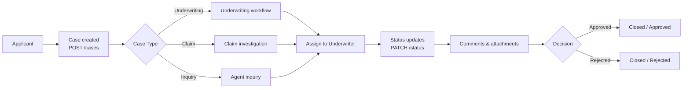
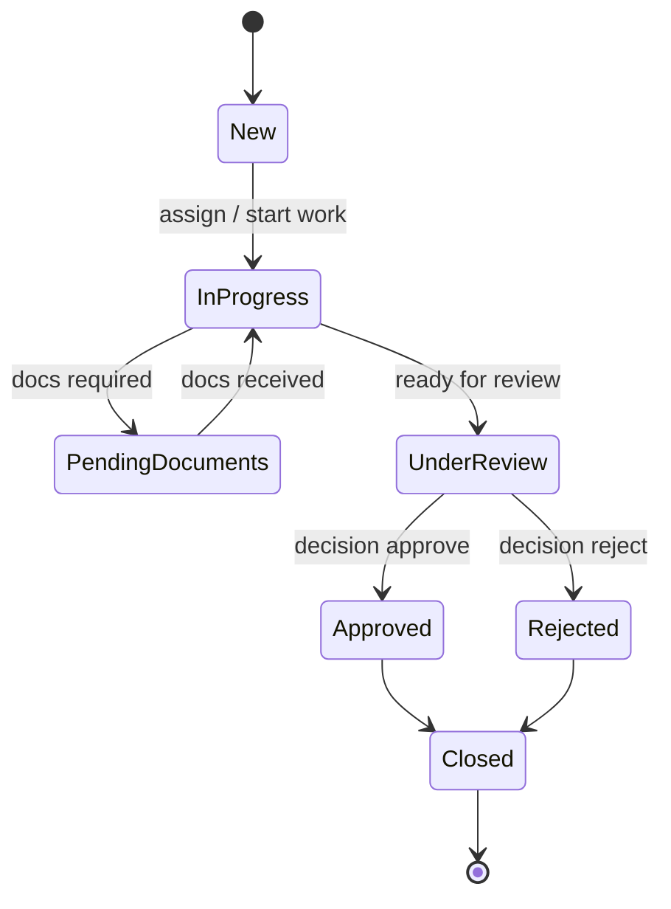
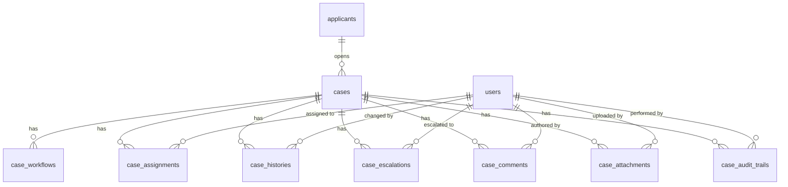

# Case Management

The case management module provides a full lifecycle for tracking insurance work items — underwriting proposals, claim investigations, and general inquiries. Every case has an audit trail, workflow state, assignment history, comments, and file attachments.

---

## Overview



---

## Case status lifecycle



| Status | Meaning |
|---|---|
| `New` | Just created, unassigned |
| `InProgress` | Actively being worked on |
| `Pending Documents` | Waiting on applicant to supply documents |
| `Under Review` | Submitted for final review / decision |
| `Approved` | Decision made — approved |
| `Rejected` | Decision made — rejected |
| `Closed` | Terminal state |

---

## API endpoints

All endpoints are proxied through the API Gateway (`:8010`) to the Tenant Service (`:8011`). All require a `Bearer` token.

| Method | Path | Description |
|---|---|---|
| `POST` | `/tenants/{tenant_id}/cases` | Create a case — auto-generates case number, writes audit entry |
| `GET` | `/tenants/{tenant_id}/cases` | List cases — filterable by `applicant_id`, `status`, `assigned_user` |
| `GET` | `/tenants/{tenant_id}/cases/{case_id}` | Get a single case |
| `PUT` | `/tenants/{tenant_id}/cases/{case_id}` | Update case fields |
| `DELETE` | `/tenants/{tenant_id}/cases/{case_id}` | Delete case and all child records (cascade) |
| `PATCH` | `/tenants/{tenant_id}/cases/{case_id}/status` | Change status — creates a `CaseHistory` entry |
| `POST` | `/tenants/{tenant_id}/cases/{case_id}/assignments` | Assign case to a user |
| `POST` | `/tenants/{tenant_id}/cases/{case_id}/comments` | Add a comment |

### Create case — request body

```json
{
  "applicant_id": "uuid",
  "caseType": "Underwriting",
  "priorityLevel": "Normal",
  "sourceChannel": "Agent",
  "assignedTeamld": null,
  "assignedAgentId": null
}
```

The case number is auto-generated as `CASE-YYYY-XXXXXX` (e.g. `CASE-2026-A3F9C1`).

### Update status — request body

```json
{ "status": "InProgress" }
```

Every status change writes a `CaseHistory` row recording `fromStatus`, `toStatus`, `changedBy`, and `changeTimestamp`.

### Assign case — request body

```json
{
  "assignedToUserld": "uuid",
  "assignedRole": "Underwriter"
}
```

Creates a `CaseAssignment` record with `assignmentType = Primary` and `assignmentStatus = Active`. Also updates `assignedAgentId` on the `Case` row.

### Add comment — request body

```json
{
  "commentText": "Requested additional salary slips from applicant.",
  "commentType": "Internal",
  "visibilityLevel": "Team"
}
```

---

## Database schema

All tables are defined in `shared/models/core.py`. Delete cascades are handled manually in the router (not via FK cascade) to avoid `NotNullViolationError` — the order is: `CaseHistory` → `CaseAuditTrail` → `CaseComment` → `CaseAssignment` → `Case`.

### Entity relationships



### `cases`

| Column | Type | Notes |
|---|---|---|
| `caseld` | UUID PK | Auto-generated |
| `tenant_id` | UUID FK → `tenants.id` | Indexed |
| `applicant_id` | UUID FK → `applicants.id` | Indexed |
| `caseNumber` | VARCHAR(50) | Unique; auto-generated `CASE-YYYY-XXXXXX` |
| `caseType` | ENUM | `Underwriting`, `Claim`, `Inquiry` |
| `caseStatus` | ENUM | Default `New`; see lifecycle above |
| `priorityLevel` | ENUM | `Low`, `Normal`, `High`, `Critical`; default `Normal` |
| `sourceChannel` | ENUM | `Agent`, `Bancassurance`, `Online`, `Branch`, `Mobile` |
| `assignedTeamld` | UUID nullable | Team FK (no FK constraint — team table not yet defined) |
| `assignedAgentId` | UUID FK → `users.id` nullable | Currently assigned agent |
| `slaDeadline` | TIMESTAMP nullable | SLA expiry time |
| `escalationLevel` | INT | Default 0; incremented on escalation |
| `parentCaseld` | UUID FK → `cases.caseld` nullable | Sub-case / linked case |
| `createdAt` | TIMESTAMP | UTC |
| `updatedAt` | TIMESTAMP | UTC; updated on every save |

### `case_statuses`

Reference table for status metadata (not currently used in routing logic, available for UI).

| Column | Type | Notes |
|---|---|---|
| `statusld` | UUID PK | |
| `statusName` | ENUM | Unique |
| `statusCategory` | ENUM | `Open`, `Active`, `Pending`, `Terminal` |
| `isFinalStatus` | BOOLEAN | `true` for `Approved`, `Rejected`, `Closed` |
| `description` | TEXT nullable | |

### `case_workflows`

Tracks the current step in the workflow engine for a case.

| Column | Type | Notes |
|---|---|---|
| `workflowid` | UUID PK | |
| `caseld` | UUID FK → `cases.caseld` | Indexed |
| `currentStep` | VARCHAR(100) | e.g. `medical_review`, `financial_approval` |
| `previousStep` | VARCHAR(100) nullable | |
| `workflowState` | ENUM | `Running`, `Paused`, `Completed`, `Failed` |
| `triggeredBy` | UUID nullable | User who triggered the step |
| `lastUpdatedAt` | TIMESTAMP | UTC |
| `workflowVersion` | VARCHAR(20) | Workflow schema version |

### `case_assignments`

One or more user assignments per case. Primary assignment drives `assignedAgentId` on the case.

| Column | Type | Notes |
|---|---|---|
| `assignmentld` | UUID PK | |
| `caseld` | UUID FK → `cases.caseld` | Indexed |
| `assignedToUserld` | UUID FK → `users.id` | Indexed |
| `assignedRole` | ENUM | `Underwriter`, `Analyst`, `Manager`, `Coordinator`, `Reviewer` |
| `assignmentType` | ENUM | `Primary`, `Secondary`, `Escalation`, `Temporary` |
| `assignmentStatus` | ENUM | `Active`, `Completed`, `Transferred`, `Revoked`; default `Active` |
| `workloadPercentage` | FLOAT | Default `100.0` |
| `assignedAt` | TIMESTAMP | UTC |

### `case_histories`

Immutable log of every action taken on a case. Written on status changes (and extensible to any `ActionTypeEnum`).

| Column | Type | Notes |
|---|---|---|
| `historyld` | UUID PK | |
| `caseld` | UUID FK → `cases.caseld` | Indexed |
| `actionType` | ENUM | `StatusChange`, `Assignment`, `Comment`, `Escalation`, `DocumentUpload`, `Decision` |
| `fromStatus` | VARCHAR(50) nullable | Previous status value |
| `toStatus` | VARCHAR(50) nullable | New status value |
| `changedBy` | UUID FK → `users.id` | Indexed |
| `changeTimestamp` | TIMESTAMP | UTC |
| `systemGeneratedFlag` | BOOLEAN | `true` for automated/system actions |

### `case_priorities`

Reference table mapping priority levels to scores and escalation rules.

| Column | Type | Notes |
|---|---|---|
| `priorityld` | UUID PK | |
| `priorityLevel` | ENUM | Unique |
| `priorityScore` | INT | Higher = more urgent |
| `escalationRuleld` | UUID nullable | FK to a future escalation-rules table |

### `case_escalations`

Records when and why a case was escalated.

| Column | Type | Notes |
|---|---|---|
| `escalationld` | UUID PK | |
| `caseld` | UUID FK → `cases.caseld` | Indexed |
| `escalationLevel` | INT | 1, 2, 3… |
| `escalationReason` | TEXT | Required |
| `escalatedTo` | UUID FK → `users.id` | Indexed |
| `escalationTimestamp` | TIMESTAMP | UTC |
| `resolutionStatus` | ENUM | `Open`, `Resolved`, `Pending`, `Closed`; default `Open` |

### `case_comments`

Internal and external comments on a case with visibility control.

| Column | Type | Notes |
|---|---|---|
| `commentld` | UUID PK | |
| `caseld` | UUID FK → `cases.caseld` | Indexed |
| `authorld` | UUID FK → `users.id` | Indexed |
| `commentText` | TEXT | |
| `commentType` | ENUM | `Internal`, `External` |
| `visibilityLevel` | ENUM | `Private`, `Team`, `All` |
| `createdAt` | TIMESTAMP | UTC |

### `case_attachments`

File attachments stored at an external URL (S3 / object storage).

| Column | Type | Notes |
|---|---|---|
| `attachmentid` | UUID PK | |
| `caseld` | UUID FK → `cases.caseld` | Indexed |
| `fileName` | VARCHAR(255) | |
| `fileType` | VARCHAR(50) | MIME type or extension |
| `fileSize` | INT nullable | Bytes |
| `storageUrl` | VARCHAR(500) | External storage URL |
| `uploadedBy` | UUID FK → `users.id` | Indexed |
| `uploadedAt` | TIMESTAMP | UTC |
| `documentClassification` | ENUM | `Medical`, `Financial`, `Identity`, `Legal`, `Other` |

### `case_audit_trails`

Immutable compliance log written on case creation and significant events. Unlike `case_histories` (which is action-typed), this table records raw field-level changes.

| Column | Type | Notes |
|---|---|---|
| `auditld` | UUID PK | |
| `caseld` | UUID indexed | No FK constraint (intentional — audit survives case deletion) |
| `actionPerformed` | VARCHAR(200) | e.g. `"Created new case"` |
| `entityChanged` | VARCHAR(100) | e.g. `"Case"`, `"CaseStatus"` |
| `previousValue` | VARCHAR nullable | Before value |
| `newValue` | VARCHAR nullable | After value |
| `performedBy` | UUID FK → `users.id` | Indexed |
| `timestamp` | TIMESTAMP | UTC |
| `ipAddress` | VARCHAR(45) nullable | For future request-context capture |

---

## Enums reference

| Enum | Values |
|---|---|
| `CaseTypeEnum` | `Underwriting`, `Claim`, `Inquiry` |
| `CaseStatusEnum` | `New`, `InProgress`, `Pending Documents`, `Under Review`, `Approved`, `Rejected`, `Closed` |
| `CasePriorityEnum` | `Low`, `Normal`, `High`, `Critical` |
| `SourceChannelEnum` | `Agent`, `Bancassurance`, `Online`, `Branch`, `Mobile` |
| `StatusCategoryEnum` | `Open`, `Active`, `Pending`, `Terminal` |
| `WorkflowStateEnum` | `Running`, `Paused`, `Completed`, `Failed` |
| `AssignedRoleEnum` | `Underwriter`, `Analyst`, `Manager`, `Coordinator`, `Reviewer` |
| `AssignmentTypeEnum` | `Primary`, `Secondary`, `Escalation`, `Temporary` |
| `AssignmentStatusEnum` | `Active`, `Completed`, `Transferred`, `Revoked` |
| `ActionTypeEnum` | `StatusChange`, `Assignment`, `Comment`, `Escalation`, `DocumentUpload`, `Decision` |
| `ResolutionStatusEnum` | `Open`, `Resolved`, `Pending`, `Closed` |
| `CommentTypeEnum` | `Internal`, `External` |
| `VisibilityLevelEnum` | `Private`, `Team`, `All` |
| `DocumentClassificationEnum` | `Medical`, `Financial`, `Identity`, `Legal`, `Other` |
