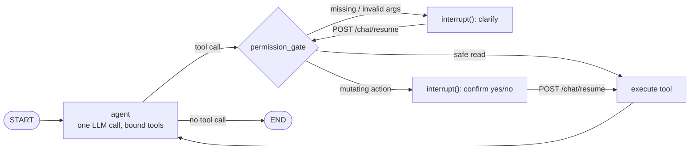

# AI Copilot (Chat Agent)

The copilot is a conversational agent embedded in the web portal (and the agent app's Chat screen) that can look things up, onboard leads, run the underwriting and claims pipelines, and navigate the UI — while every mutating action is gated in code, not just in the prompt.

**Service:** `services/chat-agent/` (port 8016:8006) · **Called via:** API Gateway `/chat/*`, which adds the caller's `Authorization` / `X-Tenant-Id` scoping.

## Graph

- **`agent`** — a single LLM call (provider from [LLM config](/llm-providers)) bound to the tools selected for this turn.
- **`permission_gate`** (`permission.py`, `validation.py`) — decides whether a proposed tool call runs immediately, needs a clarifying question, or needs explicit confirmation. Uses LangGraph `interrupt()`, so the graph genuinely pauses at a checkpoint until the client calls `POST /chat/resume`.
- **Checkpointing** — `AsyncPostgresSaver` in PostgreSQL, so threads survive restarts.
- **Tool execution** — `tool_executor.py` is the single place every tool's REST call lives (to the gateway or tenant-service). It is shared by the graph and by `POST /chat/execute-tool` (used by the voice overlay).

## Permissions & validation

| Rule | Where |
|---|---|
| Mutating tools (`add_customer`, `create_case`, `upload_document`, `run_risk_assessment`, `verify_e_application`, …) always require a yes/no confirmation | `MUTATING_TOOLS` in `permission.py` |
| Required args per tool; missing ones trigger a clarifying question | `permission.py` |
| Role restrictions (`is_role_allowed(tool, role, platform)`), including claims roles and tools blocked on the Agent-only mobile client | `permission.py` |
| Auto-fix of near-valid input (13 raw CNIC digits → `XXXXX-XXXXXXX-X`, loose dates → `YYYY-MM-DD`); human-readable errors for genuinely bad values | `validation.py` |

## Domain-scoped toolsets

Binding every tool schema on every call was ~7k+ input tokens. `toolsets.py` assembles the toolset per turn:

- **Core** (always bound): navigation (`navigate_to_page`, `show_record`, `search_records`), everyday reads, intake (`add_customer`, `add_organization`, `add_family_group`), case handling, the pre-underwriting gates, risk assessment, and the autonomous journeys — everything the base prompt names.
- **Domain packs** — `admin`, `rules`, `claims`, `commission` — bound only when recent messages match their keywords (plus a sticky carry-over from the last turn). If nothing matches, all packs are bound, so a missed keyword only costs tokens, never capability.

## Autonomous journeys

| Journey | Stages | Pauses for a human when |
|---|---|---|
| **Underwriting** (`journey.py`, `start_underwriting_journey`) | Intake → Case → Proposal → Document Audit → Risk Assessment → Decision → Closure | Documents missing (`Pending Documents`, upload chips) · decision needs human review (`Under Review`, approve/reject chips) |
| **Claims** (`claims_journey.py`, `start_claim_journey`) | FNOL → Triage → Document Audit → Fraud & Contestability → Adjudication → Disbursement → Closure | No documents · contestability/duplicate (`Underwriting Referral`) · over PKR 500k or referred (`Manager Review`) |

`continue_underwriting_journey` / `continue_claim_journey` resume from persisted state.

**Bulk underwriting** — `POST /chat/bulk-underwriting/stream` runs the pipeline over many customers, streaming progress.

## Frontend contract

Tool results may carry keys the frontend consumes directly (not the LLM):

| Key | Effect |
|---|---|
| `last_action` | `{tool_name, entity_type, entity_id, route, label}` → toast, navigate, highlight the row |
| `quick_actions` | Suggested next-step chips (`{label, actionType, payload}`) |

`pages.py` is the canonical registry of navigable frontend routes and the query param each page uses to highlight a record. Suggested next actions after common events are also served by tenant-service `POST /agent/suggest-actions`, guided by the SOPs in `docs/agent-scenarios/`.

The copilot also listens to [live case events](/data-flow#live-case-events-sse) — e.g. it can start E-Application verification the moment a customer submits the form.

## Cost controls

- **History trimming** (`history.py`) — keeps a recent window and compacts large tool results before they are checkpointed, so long threads don't re-bill whole payloads every turn.
- **Token metering** (`usage.py`) — every model call is reported to `/tokens/usage` as `Chat Agent` (or `Chat Agent — Plan Advisor`), fire-and-forget.

## Endpoints

| Method | Path | Description |
|---|---|---|
| `POST` | `/chat/stream` | Send a message; SSE stream of tokens, tool activity, interrupts |
| `POST` | `/chat/resume` | Answer an interrupt (confirm / clarify) |
| `POST` | `/chat/title` | Short conversation title |
| `POST` | `/chat/execute-tool` | One-off tool execution outside the graph |
| `POST` | `/chat/bulk-underwriting/stream` | Bulk underwriting (SSE) |
| `GET` | `/health` | Health check |
