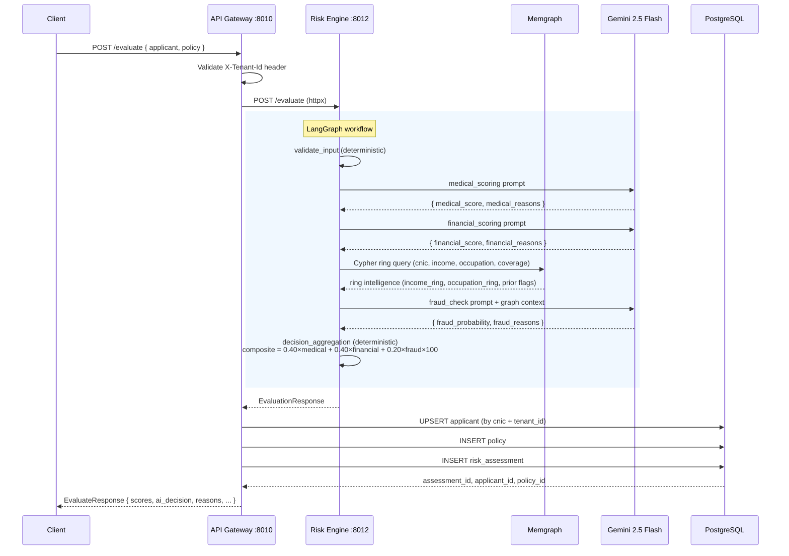
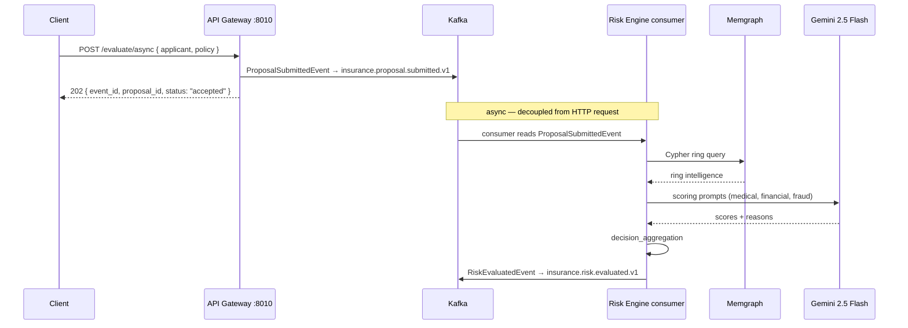
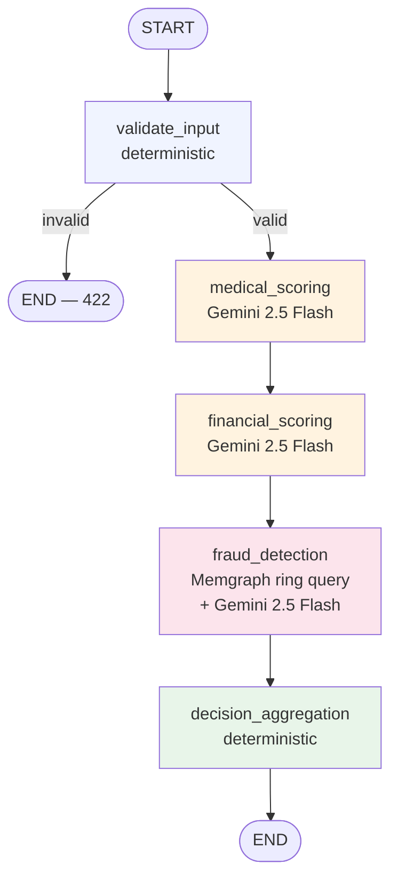

# Data Flow

## Synchronous evaluate (primary path)

The API Gateway calls the Risk Engine directly and waits for the full result before writing to the database and returning to the client. This is the default path for `POST /evaluate`.



## Asynchronous evaluate (Kafka path)

The API Gateway immediately returns a `202 Accepted` response and publishes the proposal to Kafka. The Risk Engine consumer picks it up, runs the same LangGraph workflow, and publishes the result to a downstream topic.



### Kafka event schemas

Both envelopes are in `shared/events/kafka_events.py`:

```python
# Producer: API Gateway  →  Topic: insurance.proposal.submitted.v1
class ProposalSubmittedEvent(BaseModel):
    event_id: UUID          # correlation ID
    event_type: str         # "ProposalSubmitted"
    timestamp: datetime
    tenant_id: UUID
    payload: ProposalPayload  # { proposal_id, applicant, policy }

# Producer: Risk Engine  →  Topic: insurance.risk.evaluated.v1
class RiskEvaluatedEvent(BaseModel):
    event_id: UUID
    event_type: str         # "RiskEvaluated"
    timestamp: datetime
    correlation_id: UUID    # matches ProposalSubmittedEvent.event_id
    payload: RiskEvaluatedPayload  # { proposal_id, scores, ai_decision, reasons }
```

## LangGraph workflow (Risk Engine internals)



### Node details

| Node | Type | Inputs | Outputs |
|---|---|---|---|
| `validate_input` | Deterministic | `applicant`, `policy` | `is_valid`, `validation_errors` |
| `medical_scoring` | LLM (structured output) | `applicant` | `medical_score` (0–100), `medical_reasons` |
| `financial_scoring` | LLM (structured output) | `applicant`, `policy` | `financial_score` (0–100), `financial_reasons` |
| `fraud_detection` | Memgraph + LLM | `applicant`, `policy` + graph context | `fraud_probability` (0.0–1.0), `fraud_reasons` |
| `decision_aggregation` | Deterministic | all scores + reasons | `composite_risk_score`, `ai_decision`, `reasons` |

### Validation rules (validate_input)

- Applicant age must be 18–70 years
- `declared_income` > 0
- `coverage_amount` > 0
- `coverage_amount` ≤ 20 × `declared_income`
- `term_years` must be 1–40

### Decision bands (decision_aggregation)

```
composite = (0.40 × medical) + (0.40 × financial) + (0.20 × fraud × 100)

Auto Approve       → composite < 30  AND  fraud < 0.10
Decline            → composite > 75  OR   fraud > 0.60
Human Review       → everything else
```

If any upstream LangGraph node fails, the aggregation node defaults the missing score to 50 / 0.5, keeping the decision safely in the `Human Review` band rather than accidentally auto-approving.

## Streaming (SSE)

Both the Risk Engine and OCR Engine support `POST /evaluate/stream` and `POST /extract/stream` respectively. Each completed LangGraph node (or Gemini chunk) is emitted as a Server-Sent Event:

```json
// Progress event (one per LangGraph node)
{ "type": "progress", "node": "medical_scoring", "data": { "medical_score": 42, ... } }

// Final event
{ "type": "done", "data": { /* full RiskState */ } }

// Error event
{ "type": "error", "message": "..." }
```
