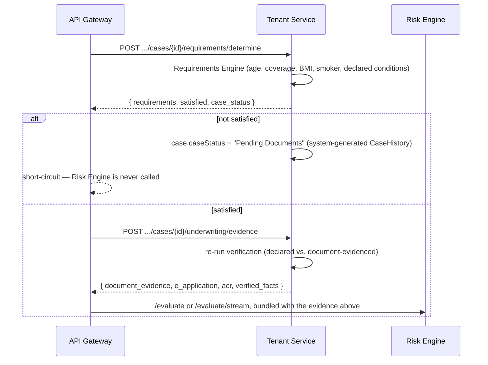
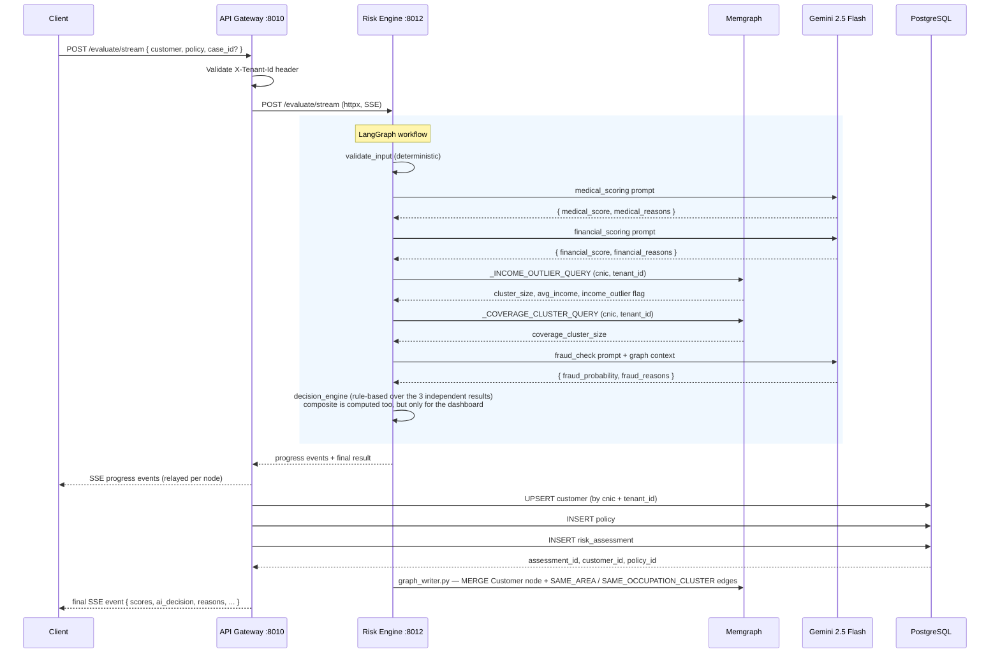
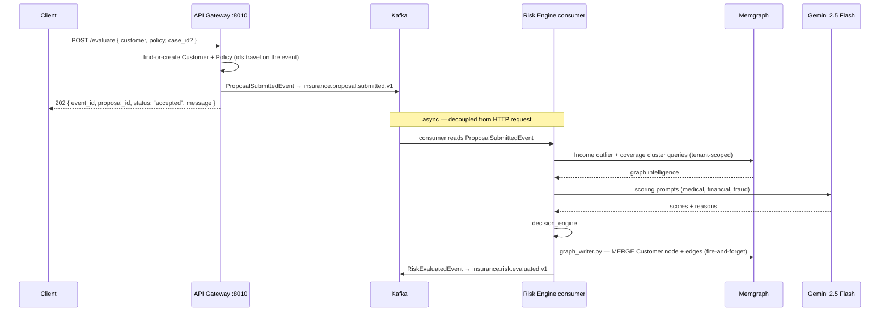
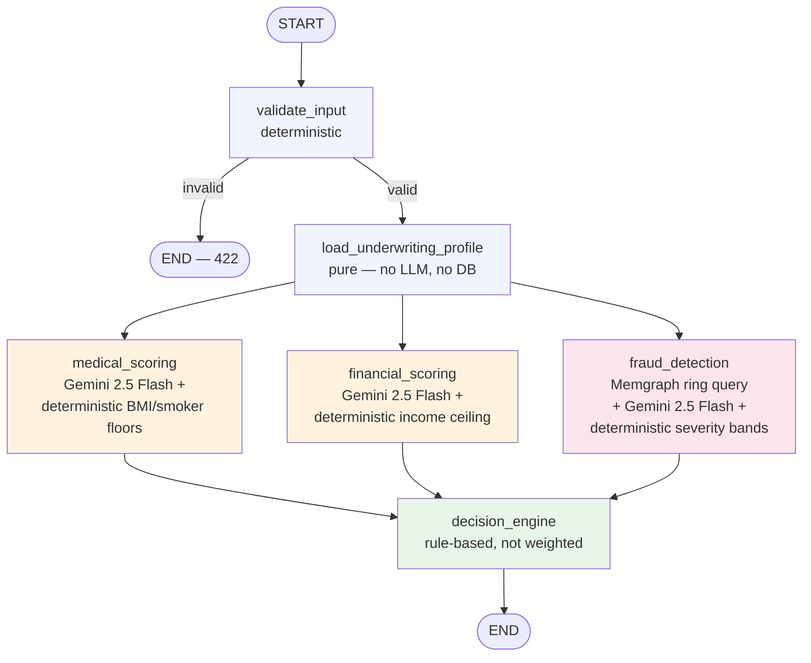
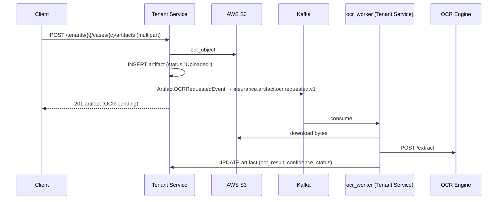

# Data Flow

## Requirements/evidence gate (runs before either evaluate path below)

For any case-scoped evaluation (a `case_id` is present — a case-less Live Evaluation
what-if check skips this entirely), api-gateway calls tenant-service **before** ever
reaching the Risk Engine:


```mermaid
sequenceDiagram
    participant GW as API Gateway
    participant TS as Tenant Service
    participant RE as Risk Engine

    GW->>TS: POST .../cases/{id}/requirements/determine
    TS->>TS: Requirements Engine (age, coverage, BMI, smoker, declared conditions)
    TS-->>GW: { requirements, satisfied, case_status }
    alt not satisfied
        TS->>TS: case.caseStatus = "Pending Documents" (system-generated CaseHistory)
        GW-->>GW: short-circuit — Risk Engine is never called
    else satisfied
        GW->>TS: POST .../cases/{id}/underwriting/evidence
        TS->>TS: re-run verification (declared vs. document-evidenced)
        TS-->>GW: { document_evidence, e_application, acr, verified_facts }
        GW->>RE: /evaluate or /evaluate/stream, bundled with the evidence above
    end
```

This is what makes "missing mandatory requirements pause the workflow" true structurally —
the Risk Engine is simply never invoked, rather than being invoked and told to produce a
particular answer.

## Streaming evaluate — `POST /evaluate/stream`

The API Gateway calls the Risk Engine's `/evaluate/stream`, relays each LangGraph node to the client as an SSE event, and persists the result through `risk_persistence.persist_assessment` (the same function the async worker uses, so the two paths cannot drift). The web portal's Live Evaluation and case workbench use this path.


```mermaid
sequenceDiagram
    participant C as Client
    participant GW as API Gateway :8010
    participant RE as Risk Engine :8012
    participant MG as Memgraph
    participant LLM as Gemini 2.5 Flash
    participant PG as PostgreSQL

    C->>GW: POST /evaluate/stream { customer, policy, case_id? }
    GW->>GW: Validate X-Tenant-Id header

    GW->>RE: POST /evaluate/stream (httpx, SSE)

    rect rgb(240, 248, 255)
        note over RE: LangGraph workflow
        RE->>RE: validate_input (deterministic)
        RE->>LLM: medical_scoring prompt
        LLM-->>RE: { medical_score, medical_reasons }
        RE->>LLM: financial_scoring prompt
        LLM-->>RE: { financial_score, financial_reasons }
        RE->>MG: _INCOME_OUTLIER_QUERY (cnic, tenant_id)
        MG-->>RE: cluster_size, avg_income, income_outlier flag
        RE->>MG: _COVERAGE_CLUSTER_QUERY (cnic, tenant_id)
        MG-->>RE: coverage_cluster_size
        RE->>LLM: fraud_check prompt + graph context
        LLM-->>RE: { fraud_probability, fraud_reasons }
        RE->>RE: decision_engine (rule-based over the 3 independent results)<br/>composite is computed too, but only for the dashboard
    end

    RE-->>GW: progress events + final result
    GW-->>C: SSE progress events (relayed per node)

    GW->>PG: UPSERT customer (by cnic + tenant_id)
    GW->>PG: INSERT policy
    GW->>PG: INSERT risk_assessment
    PG-->>GW: assessment_id, customer_id, policy_id
    RE->>MG: graph_writer.py — MERGE Customer node + SAME_AREA / SAME_OCCUPATION_CLUSTER edges

    GW-->>C: final SSE event { scores, ai_decision, reasons, ... }
```

## Asynchronous evaluate — `POST /evaluate` (Kafka path)

The API Gateway find-or-creates the `Customer`/`Policy` (and uses the `Case`, if given) so the result has stable rows to attach to, publishes the proposal to Kafka, and immediately returns `202 Accepted`. The Risk Engine consumer picks it up, runs the same LangGraph workflow, and publishes the result to a downstream topic.


```mermaid
sequenceDiagram
    participant C as Client
    participant GW as API Gateway :8010
    participant KF as Kafka
    participant RE as Risk Engine consumer
    participant MG as Memgraph
    participant LLM as Gemini 2.5 Flash

    C->>GW: POST /evaluate { customer, policy, case_id? }
    GW->>GW: find-or-create Customer + Policy (ids travel on the event)
    GW->>KF: ProposalSubmittedEvent → insurance.proposal.submitted.v1
    GW-->>C: 202 { event_id, proposal_id, status: "accepted", message }

    note over KF,RE: async — decoupled from HTTP request
    KF->>RE: consumer reads ProposalSubmittedEvent
    RE->>MG: Income outlier + coverage cluster queries (tenant-scoped)
    MG-->>RE: graph intelligence
    RE->>LLM: scoring prompts (medical, financial, fraud)
    LLM-->>RE: scores + reasons
    RE->>RE: decision_engine
    RE->>MG: graph_writer.py — MERGE Customer node + edges (fire-and-forget)
    RE->>KF: RiskEvaluatedEvent → insurance.risk.evaluated.v1
```

A downstream consumer, api-gateway's `risk_result_worker.py`, polls
`insurance.risk.evaluated.v1`, resolves the `Customer`/`Policy`/`Case` the gateway persisted
before publishing (their ids are echoed back on the payload), and writes the
`RiskAssessment` — deduping on `RiskEvaluatedEvent.correlation_id` so a redelivered message
is never persisted twice.

### Kafka event schemas

Both envelopes are in `shared/events/kafka_events.py`:

```python
# Producer: API Gateway  →  Topic: insurance.proposal.submitted.v1
class ProposalSubmittedEvent(BaseModel):
    event_id: UUID          # correlation ID
    event_type: str         # "ProposalSubmitted"
    timestamp: datetime
    tenant_id: UUID
    payload: ProposalPayload  # { proposal_id, customer, policy }

# Producer: Risk Engine  →  Topic: insurance.risk.evaluated.v1
class RiskEvaluatedEvent(BaseModel):
    event_id: UUID
    event_type: str         # "RiskEvaluated"
    timestamp: datetime
    correlation_id: UUID    # matches ProposalSubmittedEvent.event_id
    payload: RiskEvaluatedPayload  # { proposal_id, scores, ai_decision, reasons }
```

## LangGraph workflow (Risk Engine internals)


```mermaid
flowchart TD
    START([START]) --> V[validate_input\ndeterministic]
    V -->|invalid| END1([END — 422])
    V -->|valid| P[load_underwriting_profile\npure — no LLM, no DB]
    P --> M[medical_scoring\nGemini 2.5 Flash +\ndeterministic BMI/smoker floors]
    P --> F[financial_scoring\nGemini 2.5 Flash +\ndeterministic income ceiling]
    P --> FR[fraud_detection\nMemgraph ring query\n+ Gemini 2.5 Flash +\ndeterministic severity bands]
    M --> D[decision_engine\nrule-based, not weighted]
    F --> D
    FR --> D
    D --> END2([END])

    style V fill:#f0f4ff
    style P fill:#f0f4ff
    style M fill:#fff3e0
    style F fill:#fff3e0
    style FR fill:#fce4ec
    style D fill:#e8f5e9
```

`medical_scoring`/`financial_scoring`/`fraud_detection` run as parallel branches (LangGraph
fan-out from `load_underwriting_profile`), then join at `decision_engine`.

### Node details

| Node | Type | Inputs | Outputs |
|---|---|---|---|
| `validate_input` | Deterministic | `customer`, `policy` | `is_valid`, `validation_errors` |
| `load_underwriting_profile` | Deterministic, pure | `customer`, `policy`, `e_application`, `acr`, `document_evidence`, `verified_facts` | `underwriting_profile` (see `shared/underwriting/profile.py`) |
| `medical_scoring` | LLM + deterministic floors | `customer`, `underwriting_profile` | `medical_score`, `medical_reasons`, `medical_result` (`MedicalUnderwritingResult`) |
| `financial_scoring` | LLM + deterministic ceiling | `customer`, `policy`, `underwriting_profile` | `financial_score`, `financial_reasons`, `financial_result` (`FinancialUnderwritingResult`) |
| `fraud_detection` | Memgraph + LLM + deterministic bands | `customer`, `policy`, `tenant_id` + graph context | `fraud_probability`, `fraud_reasons`, `fraud_result` (`FraudAssessment`) |
| `decision_engine` | Deterministic, rule-based | `medical_result`, `financial_result`, `fraud_result`, `requirements_satisfied`, `verified_facts` | `ai_decision`, `composite_risk_score` (dashboard only), `reasons`, `underwriting_results` |

### Validation rules (validate_input)

Rules are **plan-specific**, keyed by `policy.insurance_type` — see `services/risk-engine/underwriting_rules.py` (`UNDERWRITING_RULES`). If `insurance_type` is missing/unrecognized, a generic fallback band applies (age 18–70, term 1–40, income multiple 20×).

| Insurance type | Entry age | Term (yrs) | Max maturity age | Max income multiple | Dependent age |
|---|---|---|---|---|---|
| `TERM_LIFE` | 18–65 | 5–30 | 70 | 20× | — |
| `WHOLE_LIFE` | 18–65 | 1–40 | 99 | 25× | — |
| `ENDOWMENT` | 18–60 | 10–30 | 70 | 15× | — |
| `CHILD_EDUCATION_MARRIAGE` | 20–60 (proposer) | 10–24 | 70 | 15× | 1–15 |

Common checks across all plans:
- `declared_income` > 0, `coverage_amount` > 0
- `coverage_amount` ≤ plan's max income multiple × `declared_income`
- proposer age + `term_years` must not exceed the plan's max maturity age
- for `CHILD_EDUCATION_MARRIAGE`, `policy.dependent_dob` is required and the dependent's age must fall in the plan's band

Each plan also carries `medical_exam_tiers` (coverage-amount thresholds mapping to `None` / `Paramedical` / `Full medical + financials`) — not yet surfaced in `validation_errors`, informational for a future underwriter-facing rule panel.

### Decision rules (decision_engine)

`decision_engine` is a sequential rule chain over the three independent structured results —
not a weighted sum (see `shared/underwriting/decision_rules.py`):

```
1. requirements not satisfied         → Request Additional Evidence
2. fraud severity High/Critical       → Fraud Investigation
3. fraud severity Medium              → Human Review
4. medical classification Decline     → Decline
5. medical classification Postpone    → Postpone
6. medical ambiguous/review-required  → Human Review
7. financial not justified            → Decline (or Human Review if referral_required)
8. unresolved high-severity finding   → Human Review
9. medical Substandard/Rated/loading  → Approve with Loading
10. financial referral / medium finding → Human Review
11. everything clears                 → Auto Approve
```

A composite score (`0.40×medical + 0.40×financial + 0.20×fraud×100`) is still computed and
returned for the dashboard, but `decision_engine` never branches on it. If any upstream
LangGraph node fails, `decision_engine` falls back to the most conservative structured result
(`Medical Review Required`, `financially_justified=False`, fraud severity `Medium`) rather
than a numeric default — so a failure still routes to `Human Review`/`Fraud Investigation`,
never an accidental `Auto Approve`.

## Artifact OCR (Kafka path)


```mermaid
sequenceDiagram
    participant C as Client
    participant TS as Tenant Service
    participant S3 as AWS S3
    participant KF as Kafka
    participant W as ocr_worker (Tenant Service)
    participant OCR as OCR Engine

    C->>TS: POST /tenants/{t}/cases/{c}/artifacts (multipart)
    TS->>S3: put_object
    TS->>TS: INSERT artifact (status "Uploaded")
    TS->>KF: ArtifactOCRRequestedEvent → insurance.artifact.ocr.requested.v1
    TS-->>C: 201 artifact (OCR pending)
    KF->>W: consume
    W->>S3: download bytes
    W->>OCR: POST /extract
    W->>TS: UPDATE artifact (ocr_result, confidence, status)
```

## Live case events (SSE)

Some case progress happens outside any staff session — e.g. a customer submitting their E-Application from the public link. Tenant Service publishes a `CaseEvent` to `insurance.case.events.v1`; the gateway's `case_event_hub` (one consumer group per process, starting at `latest`) fans it out to every browser tab of that tenant connected to `GET /events/stream`, so the copilot can react immediately. Delivery is best-effort; a client that was offline re-reads case status on reconnect.

## Kafka topics

| Topic | Event | Producer | Consumer |
|---|---|---|---|
| `insurance.proposal.submitted.v1` | `ProposalSubmittedEvent` | API Gateway (`POST /evaluate`) | Risk Engine `consumer.py` |
| `insurance.risk.evaluated.v1` | `RiskEvaluatedEvent` | Risk Engine | Gateway `risk_result_worker` |
| `insurance.customer.created.v1` | `CustomerCreatedEvent` | Tenant Service (`customers.py`, seeds) | Gateway `quote_worker` |
| `insurance.artifact.ocr.requested.v1` | `ArtifactOCRRequestedEvent` | Tenant Service (`artifacts.py`) | Tenant Service `ocr_worker` |
| `insurance.case.events.v1` | `CaseEvent` | Tenant Service (`services/case_events.py`) | Gateway `case_event_hub` |
| `insurance.policy.lifecycle.v1` | `PolicyLifecycleEvent` | Tenant Service (`policies.py`, after commit) | — (audit stream for downstream consumers) |

All envelopes live in `shared/events/kafka_events.py`.

## Streaming (SSE)

The Risk Engine (`/evaluate/stream`), OCR Engine (`/extract/stream`), Text Summarizer (`/summarize/stream`) and Chat Agent (`/chat/stream`) all stream Server-Sent Events. Each completed LangGraph node (or Gemini chunk) is emitted as a Server-Sent Event:

```json
// Progress event (one per LangGraph node)
{ "type": "progress", "node": "medical_scoring", "data": { "medical_score": 42, ... } }

// Final event
{ "type": "done", "data": { /* full RiskState */ } }

// Error event
{ "type": "error", "message": "..." }
```
