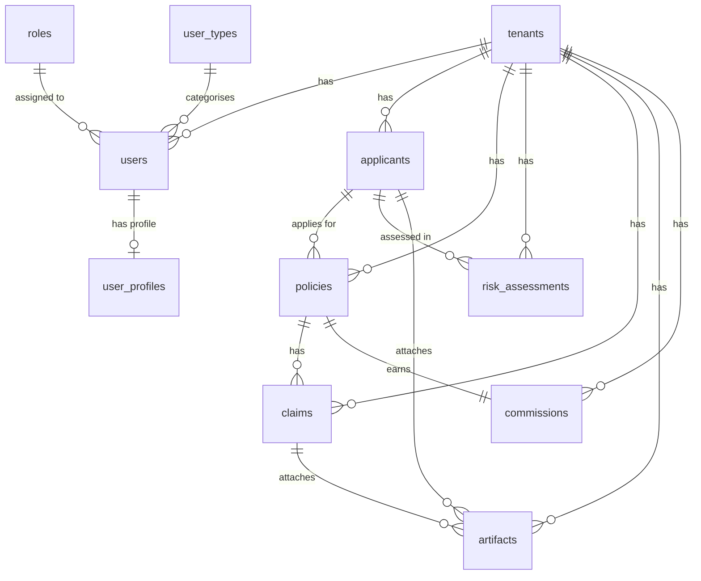

# Database Schemas

## PostgreSQL

All tables are defined as SQLModel classes in `shared/models/core.py` and created via `SQLModel.metadata.create_all()` on service startup.

### Entity relationship overview



### `tenants`

Top-level isolation boundary — one row per insurance company.

| Column | Type | Notes |
|---|---|---|
| `id` | UUID PK | Auto-generated |
| `name` | VARCHAR(255) | Unique, indexed |
| `is_active` | BOOLEAN | Default `true` |
| `created_at` | TIMESTAMP | UTC, auto-set |

### `roles`

RBAC role definitions, seeded once at Tenant Service startup.

| Column | Type | Notes |
|---|---|---|
| `id` | UUID PK | |
| `name` | VARCHAR(100) | Unique, indexed |
| `description` | VARCHAR(500) | |

**Seeded roles:** `Admin`, `Underwriter`, `Agent`, `Viewer`

### `user_types`

Optional categorisation for users (e.g. `internal`, `partner`, `broker`). Seeded or created via admin tooling.

| Column | Type | Notes |
|---|---|---|
| `id` | UUID PK | |
| `type_name` | VARCHAR(100) | Unique, indexed |
| `description` | VARCHAR(500) | |
| `is_active` | BOOLEAN | Default `true` |
| `created_at` | TIMESTAMP | UTC, auto-set |

### `users`

Employees (underwriters, agents, admins) belonging to a tenant.

| Column | Type | Notes |
|---|---|---|
| `id` | UUID PK | |
| `tenant_id` | UUID FK → `tenants.id` | Indexed |
| `role_id` | UUID FK → `roles.id` | |
| `user_type_id` | UUID FK → `user_types.id` nullable | Optional categorisation |
| `email` | VARCHAR(255) | Unique, indexed |
| `username` | VARCHAR(255) | Unique, indexed |
| `hashed_password` | VARCHAR(255) | bcrypt |
| `full_name` | VARCHAR(255) | |
| `status` | ENUM | `ACTIVE`, `INACTIVE`, `SUSPENDED`, `LOCKED`; default `ACTIVE` |
| `is_active` | BOOLEAN | Default `true` |
| `is_verified` | BOOLEAN | Default `false` |
| `failed_login_count` | INT | Default 0; incremented on bad password |
| `last_login` | TIMESTAMP nullable | Set on successful auth |
| `is_deleted` | BOOLEAN | Default `false`; soft-delete flag |
| `created_at` | TIMESTAMP | UTC, auto-set |
| `updated_at` | TIMESTAMP | UTC, updated on save |

### `user_profiles`

Detailed profile information for a user — one-to-one with `users`, cascade-deleted with the parent user.

| Column | Type | Notes |
|---|---|---|
| `id` | UUID PK | |
| `user_id` | UUID FK → `users.id` | Indexed, unique |
| `first_name` | VARCHAR(255) | |
| `last_name` | VARCHAR(255) | |
| `phone` | VARCHAR(50) nullable | |
| `avatar_url` | VARCHAR(500) nullable | |
| `department` | VARCHAR(255) nullable | |
| `employee_id` | VARCHAR(100) nullable | HR employee number |
| `designation` | VARCHAR(255) nullable | Job title |
| `date_of_joining` | DATE nullable | |
| `updated_at` | TIMESTAMP | UTC, updated on save |

### `applicants`

Personal and financial profile of an insurance applicant. `cnic` is unique per tenant.

| Column | Type | Notes |
|---|---|---|
| `id` | UUID PK | |
| `tenant_id` | UUID FK → `tenants.id` | Indexed |
| `cnic` | VARCHAR(15) | Pakistani NIC; unique per tenant (`uq_applicant_cnic_per_tenant`) |
| `name` | VARCHAR(255) | |
| `dob` | DATE | Used to calculate age at evaluation time |
| `gender` | ENUM | `Male`, `Female`, `Other` |
| `occupation` | VARCHAR(255) | Feeds medical and financial scoring |
| `declared_income` | FLOAT | Annual PKR; drives financial risk and fraud checks |
| `details` | JSON nullable | Freeform extra fields (e.g. medical history, custom KYC data) |
| `created_at` | TIMESTAMP | UTC, auto-set |

### `policies`

A requested insurance policy linked to a specific applicant and tenant.

| Column | Type | Notes |
|---|---|---|
| `id` | UUID PK | |
| `tenant_id` | UUID FK → `tenants.id` | Indexed |
| `applicant_id` | UUID FK → `applicants.id` | Indexed |
| `product_name` | VARCHAR(255) | e.g. `Term Life 20`, `Health Platinum` |
| `coverage_amount` | FLOAT | PKR; must be ≤ 20× declared income |
| `term_years` | INT | 1–40 |
| `created_at` | TIMESTAMP | UTC, auto-set |

### `risk_assessments`

Stores the underwriting output for an applicant. One applicant may have multiple assessments over time.

| Column | Type | Notes |
|---|---|---|
| `id` | UUID PK | |
| `tenant_id` | UUID FK → `tenants.id` | Indexed |
| `applicant_id` | UUID FK → `applicants.id` | Indexed |
| `medical_score` | INT | 0–100 (LLM-assigned) |
| `financial_score` | INT | 0–100 (LLM-assigned) |
| `fraud_probability` | FLOAT | 0.0–1.0 (Memgraph + LLM) |
| `ai_decision` | ENUM | `Auto Approve`, `Approve with Loading`, `Human Review`, `Decline` |
| `suggested_loading` | FLOAT nullable | Premium loading %; null unless decision is `Approve with Loading` |
| `reasons` | JSON (TEXT[]) | Ordered explainability strings for the underwriter UI |
| `created_at` | TIMESTAMP | UTC, auto-set |

### `claims`

A benefit claim filed against an active policy.

| Column | Type | Notes |
|---|---|---|
| `id` | UUID PK | |
| `tenant_id` | UUID FK → `tenants.id` | Indexed |
| `policy_id` | UUID FK → `policies.id` | Indexed |
| `claim_type` | VARCHAR(100) | e.g. `Hospitalization`, `Death`, `Reimbursement` |
| `submitted_amount` | FLOAT | PKR |
| `approved_amount` | FLOAT | PKR; default 0 |
| `status` | VARCHAR(50) | e.g. `Approved`, `Rejected`, `Investigation` |
| `fraud_probability` | FLOAT | 0.0–1.0 |
| `duplicate_flag` | BOOLEAN | Default `false` |
| `ai_recommendation` | VARCHAR(500) | |
| `created_at` | TIMESTAMP | UTC, auto-set |

### `artifacts`

A document (CNIC scan, salary slip, medical report, X-ray) attached to an applicant or a claim. Both FKs are optional — an artifact can belong to just an applicant, just a claim, or both.

| Column | Type | Notes |
|---|---|---|
| `id` | UUID PK | |
| `tenant_id` | UUID FK → `tenants.id` | Indexed |
| `applicant_id` | UUID FK → `applicants.id` nullable | Indexed |
| `claim_id` | UUID FK → `claims.id` nullable | Indexed |
| `document_type` | VARCHAR(100) | e.g. `CNIC`, `Salary Slip`, `Medical Report` |
| `ocr_confidence_score` | FLOAT | 0.0–1.0 |
| `authenticity_score` | FLOAT | 0.0–1.0 |
| `quality_score` | FLOAT | 0.0–1.0 |
| `tampered_flag` | BOOLEAN | Default `false` |
| `status` | VARCHAR(50) | e.g. `Accepted`, `Re-submission Requested` |
| `created_at` | TIMESTAMP | UTC, auto-set |

### `commissions`

Agent commission record for a sold policy.

| Column | Type | Notes |
|---|---|---|
| `id` | UUID PK | |
| `tenant_id` | UUID FK → `tenants.id` | Indexed |
| `policy_id` | UUID FK → `policies.id` | Indexed |
| `agent_id` | VARCHAR(100) | Indexed |
| `overall_ai_score` | FLOAT | 0.0–100.0 |
| `commission_percentage` | FLOAT | 0.0–100.0 |
| `calculated_amount` | FLOAT | PKR |
| `bonus_eligible` | BOOLEAN | Default `false` |
| `created_at` | TIMESTAMP | UTC, auto-set |

---

## Memgraph (Graph DB)

Memgraph is used exclusively by the **Risk Engine** for fraud ring detection. It is not used for general data storage.

### How data gets into Memgraph

`graph_writer.py` (Risk Engine) runs **fire-and-forget after every successful evaluation** — both on the sync HTTP path (`main.py`) and the async Kafka path (`consumer.py`). It uses `MERGE` (not `CREATE`) so re-evaluating the same CNIC within a tenant updates the node in place instead of duplicating it.

### Node types

| Label | Properties | Description |
|---|---|---|
| `Applicant` | `cnic`, `tenant_id`, `occupation`, `declared_income`, `coverage_amount`, `medical_score`, `financial_score`, `fraud_probability`, `evaluated_at` | Written after each evaluation; tenant-scoped via `tenant_id` |

### Relationships

All relationships are tenant-scoped (both sides must share the same `tenant_id`).

| Relationship | From → To | Created when |
|---|---|---|
| `SAME_AREA` | `Applicant ↔ Applicant` | Both applicants share the same 5-digit CNIC prefix (same geographic area) |
| `SAME_OCCUPATION_CLUSTER` | `Applicant ↔ Applicant` | Both applicants share the same `occupation` value |

### Fraud signals detected

The `fraud_check` LangGraph node runs two Cypher queries against these relationships:

| Query | Signal | Detection logic |
|---|---|---|
| `_INCOME_OUTLIER_QUERY` | **Income outlier** | Applicant's `declared_income` exceeds 3× the average income of neighbours connected by both `SAME_AREA` and `SAME_OCCUPATION_CLUSTER` — classic income-fabrication signal |
| `_COVERAGE_CLUSTER_QUERY` | **Coverage cluster** | Occupation-cluster peers applying for coverage within ±50,000 PKR of the current request — coordinated high-value applications |

Both results are formatted into a text block and passed to Gemini as **Tier 1 (hard evidence)** signals, which the LLM weights more heavily than the raw data signals. If Memgraph is unreachable both queries fall back to empty results so the workflow is never blocked.

### Useful Cypher for Memgraph Lab (`http://localhost:3001`)

```cypher
// All applicants ordered by fraud probability
MATCH (a:Applicant)
RETURN a.cnic, a.tenant_id, a.fraud_probability, a.occupation, a.declared_income
ORDER BY a.fraud_probability DESC;

// Income outliers — applicants earning 3× their cluster average
MATCH (a:Applicant)-[:SAME_AREA]->(n:Applicant)-[:SAME_OCCUPATION_CLUSTER]->(a)
WITH a, avg(n.declared_income) AS cluster_avg
WHERE cluster_avg > 0 AND a.declared_income > cluster_avg * 3
RETURN a.cnic, a.declared_income, cluster_avg
ORDER BY a.declared_income / cluster_avg DESC;

// Coverage clusters — same-occupation peers with near-identical coverage
MATCH (a:Applicant)-[:SAME_OCCUPATION_CLUSTER]->(peer:Applicant)
WHERE abs(peer.coverage_amount - a.coverage_amount) < 50000
RETURN a.cnic, a.coverage_amount, collect(peer.cnic) AS cluster_peers;
```
