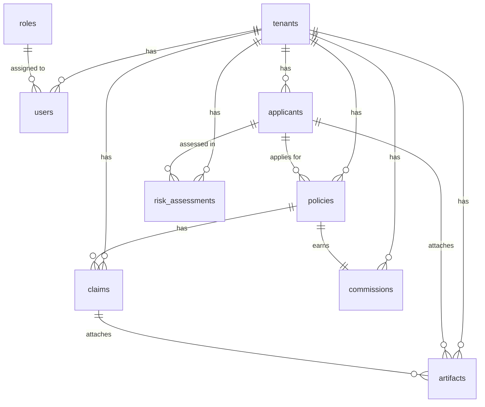

# Database Schemas

## PostgreSQL

All tables are defined as SQLModel classes in `shared/models/core.py` and created via `SQLModel.metadata.create_all()` on service startup.

### Entity relationship overview

### `tenants`

Top-level isolation boundary — one row per insurance company.

| Column | Type | Notes |
|---|---|---|
| `id` | UUID PK | Auto-generated |
| `name` | VARCHAR(255) | Unique, indexed |
| `is_active` | BOOLEAN | Default `true` |
| `created_at` | TIMESTAMP | UTC, auto-set |

### `roles`

RBAC role definitions, seeded once at Tenant Service startup.

| Column | Type | Notes |
|---|---|---|
| `id` | UUID PK | |
| `name` | VARCHAR(100) | Unique, indexed |
| `description` | VARCHAR(500) | |

**Seeded roles:** `Admin`, `Underwriter`, `Agent`, `Viewer`

### `users`

Employees (underwriters, agents, admins) belonging to a tenant.

| Column | Type | Notes |
|---|---|---|
| `id` | UUID PK | |
| `tenant_id` | UUID FK → `tenants.id` | Indexed |
| `role_id` | UUID FK → `roles.id` | |
| `email` | VARCHAR(255) | Unique, indexed |
| `hashed_password` | VARCHAR(255) | bcrypt |
| `full_name` | VARCHAR(255) | |
| `is_active` | BOOLEAN | Default `true` |
| `created_at` | TIMESTAMP | UTC, auto-set |

### `applicants`

Personal and financial profile of an insurance applicant. `cnic` is unique per tenant.

| Column | Type | Notes |
|---|---|---|
| `id` | UUID PK | |
| `tenant_id` | UUID FK → `tenants.id` | Indexed |
| `cnic` | VARCHAR(15) | Pakistani NIC; unique per tenant (`uq_applicant_cnic_per_tenant`) |
| `name` | VARCHAR(255) | |
| `dob` | DATE | Used to calculate age at evaluation time |
| `gender` | ENUM | `Male`, `Female`, `Other` |
| `occupation` | VARCHAR(255) | Feeds medical and financial scoring |
| `declared_income` | FLOAT | Annual PKR; drives financial risk and fraud checks |
| `created_at` | TIMESTAMP | UTC, auto-set |

### `policies`

A requested insurance policy linked to a specific applicant and tenant.

| Column | Type | Notes |
|---|---|---|
| `id` | UUID PK | |
| `tenant_id` | UUID FK → `tenants.id` | Indexed |
| `applicant_id` | UUID FK → `applicants.id` | Indexed |
| `product_name` | VARCHAR(255) | e.g. `Term Life 20`, `Health Platinum` |
| `coverage_amount` | FLOAT | PKR; must be ≤ 20× declared income |
| `term_years` | INT | 1–40 |
| `created_at` | TIMESTAMP | UTC, auto-set |

### `risk_assessments`

Stores the underwriting output for an applicant. One applicant may have multiple assessments over time.

| Column | Type | Notes |
|---|---|---|
| `id` | UUID PK | |
| `tenant_id` | UUID FK → `tenants.id` | Indexed |
| `applicant_id` | UUID FK → `applicants.id` | Indexed |
| `medical_score` | INT | 0–100 (LLM-assigned) |
| `financial_score` | INT | 0–100 (LLM-assigned) |
| `fraud_probability` | FLOAT | 0.0–1.0 (Memgraph + LLM) |
| `ai_decision` | ENUM | `Auto Approve`, `Approve with Loading`, `Human Review`, `Decline` |
| `suggested_loading` | FLOAT nullable | Premium loading %; null unless decision is `Approve with Loading` |
| `reasons` | JSON (TEXT[]) | Ordered explainability strings for the underwriter UI |
| `created_at` | TIMESTAMP | UTC, auto-set |

### `claims`

A benefit claim filed against an active policy.

| Column | Type | Notes |
|---|---|---|
| `id` | UUID PK | |
| `tenant_id` | UUID FK → `tenants.id` | Indexed |
| `policy_id` | UUID FK → `policies.id` | Indexed |
| `claim_type` | VARCHAR(100) | e.g. `Hospitalization`, `Death`, `Reimbursement` |
| `submitted_amount` | FLOAT | PKR |
| `approved_amount` | FLOAT | PKR; default 0 |
| `status` | VARCHAR(50) | e.g. `Approved`, `Rejected`, `Investigation` |
| `fraud_probability` | FLOAT | 0.0–1.0 |
| `duplicate_flag` | BOOLEAN | Default `false` |
| `ai_recommendation` | VARCHAR(500) | |
| `created_at` | TIMESTAMP | UTC, auto-set |

### `artifacts`

A document (CNIC scan, salary slip, medical report, X-ray) attached to an applicant or a claim. Both FKs are optional — an artifact can belong to just an applicant, just a claim, or both.

| Column | Type | Notes |
|---|---|---|
| `id` | UUID PK | |
| `tenant_id` | UUID FK → `tenants.id` | Indexed |
| `applicant_id` | UUID FK → `applicants.id` nullable | Indexed |
| `claim_id` | UUID FK → `claims.id` nullable | Indexed |
| `document_type` | VARCHAR(100) | e.g. `CNIC`, `Salary Slip`, `Medical Report` |
| `ocr_confidence_score` | FLOAT | 0.0–1.0 |
| `authenticity_score` | FLOAT | 0.0–1.0 |
| `quality_score` | FLOAT | 0.0–1.0 |
| `tampered_flag` | BOOLEAN | Default `false` |
| `status` | VARCHAR(50) | e.g. `Accepted`, `Re-submission Requested` |
| `created_at` | TIMESTAMP | UTC, auto-set |

### `commissions`

Agent commission record for a sold policy.

| Column | Type | Notes |
|---|---|---|
| `id` | UUID PK | |
| `tenant_id` | UUID FK → `tenants.id` | Indexed |
| `policy_id` | UUID FK → `policies.id` | Indexed |
| `agent_id` | VARCHAR(100) | Indexed |
| `overall_ai_score` | FLOAT | 0.0–100.0 |
| `commission_percentage` | FLOAT | 0.0–100.0 |
| `calculated_amount` | FLOAT | PKR |
| `bonus_eligible` | BOOLEAN | Default `false` |
| `created_at` | TIMESTAMP | UTC, auto-set |

---

## Memgraph (Graph DB)

Memgraph is used exclusively by the **Risk Engine** for fraud ring detection. It is not used for general data storage.

### Node types

| Label | Key properties | Description |
|---|---|---|
| `Applicant` | `cnic`, `declared_income`, `occupation`, `fraud_flagged`, `fraud_probability` | Mirrors applicant identity fields; updated after each evaluation |
| `Policy` | `coverage_amount`, `product_name`, `term_years` | The policy associated with an application |

### Relationships

| Relationship | From → To | Description |
|---|---|---|
| `APPLIED_FOR` | `Applicant → Policy` | Created when a new proposal is submitted |

### Fraud ring patterns detected

The Risk Engine executes a Cypher query (`_RING_QUERY` in `workflow.py`) that detects three ring types:

| Pattern | Signal | Detection logic |
|---|---|---|
| **Income-fabrication ring** | Multiple flagged applicants declaring the exact same `declared_income` | A coordinator supplies a shared fake salary figure |
| **Occupation-cluster ring** | Flagged peers in the same `occupation` applying for ≥ 50% of current `coverage_amount` | Coordinated high-value applications through a shared fraud network |
| **Repeat-applicant** | Same `cnic` appears in multiple `Policy` nodes | Policy stacking or application churning |

The query returns ring sizes and peer lists, which are formatted into a structured block and passed to Gemini for probabilistic fraud scoring. If Memgraph is unreachable the node falls back to `fraud_probability = 0.0` so the rest of the workflow is never blocked.
