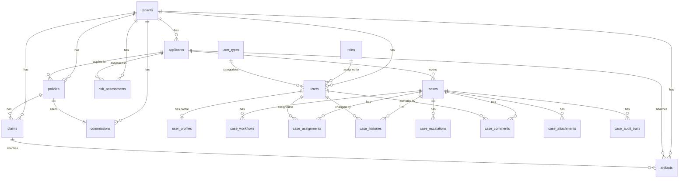

# Database Schemas

## PostgreSQL

All tables are defined as SQLModel classes in `shared/models/core.py` and created via `SQLModel.metadata.create_all()` on service startup.

### Entity relationship overview

### `tenants`

Top-level isolation boundary — one row per insurance company.

| Column | Type | Notes |
|---|---|---|
| `id` | UUID PK | Auto-generated |
| `name` | VARCHAR(255) | Unique, indexed |
| `is_active` | BOOLEAN | Default `true` |
| `created_at` | TIMESTAMP | UTC, auto-set |

### `roles`

RBAC role definitions, seeded once at Tenant Service startup.

| Column | Type | Notes |
|---|---|---|
| `id` | UUID PK | |
| `name` | VARCHAR(100) | Unique, indexed |
| `description` | VARCHAR(500) | |

**Seeded roles:** `Admin`, `Underwriter`, `Agent`, `Viewer`

### `user_types`

Optional categorisation for users (e.g. `internal`, `partner`, `broker`). Seeded or created via admin tooling.

| Column | Type | Notes |
|---|---|---|
| `id` | UUID PK | |
| `type_name` | VARCHAR(100) | Unique, indexed |
| `description` | VARCHAR(500) | |
| `is_active` | BOOLEAN | Default `true` |
| `created_at` | TIMESTAMP | UTC, auto-set |

### `users`

Employees (underwriters, agents, admins) belonging to a tenant.

| Column | Type | Notes |
|---|---|---|
| `id` | UUID PK | |
| `tenant_id` | UUID FK → `tenants.id` | Indexed |
| `role_id` | UUID FK → `roles.id` | |
| `user_type_id` | UUID FK → `user_types.id` nullable | Optional categorisation |
| `email` | VARCHAR(255) | Unique, indexed |
| `username` | VARCHAR(255) | Unique, indexed |
| `hashed_password` | VARCHAR(255) | bcrypt |
| `full_name` | VARCHAR(255) | |
| `status` | ENUM | `ACTIVE`, `INACTIVE`, `SUSPENDED`, `LOCKED`; default `ACTIVE` |
| `is_active` | BOOLEAN | Default `true` |
| `is_verified` | BOOLEAN | Default `false` |
| `failed_login_count` | INT | Default 0; incremented on bad password |
| `last_login` | TIMESTAMP nullable | Set on successful auth |
| `is_deleted` | BOOLEAN | Default `false`; soft-delete flag |
| `created_at` | TIMESTAMP | UTC, auto-set |
| `updated_at` | TIMESTAMP | UTC, updated on save |

### `user_profiles`

Detailed profile information for a user — one-to-one with `users`, cascade-deleted with the parent user.

| Column | Type | Notes |
|---|---|---|
| `id` | UUID PK | |
| `user_id` | UUID FK → `users.id` | Indexed, unique |
| `first_name` | VARCHAR(255) | |
| `last_name` | VARCHAR(255) | |
| `phone` | VARCHAR(50) nullable | |
| `avatar_url` | VARCHAR(500) nullable | |
| `department` | VARCHAR(255) nullable | |
| `employee_id` | VARCHAR(100) nullable | HR employee number |
| `designation` | VARCHAR(255) nullable | Job title |
| `date_of_joining` | DATE nullable | |
| `updated_at` | TIMESTAMP | UTC, updated on save |

### `applicants`

Personal and financial profile of an insurance applicant. `cnic` is unique per tenant.

| Column | Type | Notes |
|---|---|---|
| `id` | UUID PK | |
| `tenant_id` | UUID FK → `tenants.id` | Indexed |
| `cnic` | VARCHAR(15) | Pakistani NIC; unique per tenant (`uq_applicant_cnic_per_tenant`) |
| `name` | VARCHAR(255) | |
| `dob` | DATE | Used to calculate age at evaluation time |
| `gender` | ENUM | `Male`, `Female`, `Other` |
| `occupation` | VARCHAR(255) | Feeds medical and financial scoring |
| `declared_income` | FLOAT | Annual PKR; drives financial risk and fraud checks |
| `details` | JSON nullable | Freeform extra fields (e.g. medical history, custom KYC data) |
| `created_at` | TIMESTAMP | UTC, auto-set |

### `policies`

A requested insurance policy linked to a specific applicant and tenant.

| Column | Type | Notes |
|---|---|---|
| `id` | UUID PK | |
| `tenant_id` | UUID FK → `tenants.id` | Indexed |
| `applicant_id` | UUID FK → `applicants.id` | Indexed |
| `product_name` | VARCHAR(255) | e.g. `Term Life 20`, `Health Platinum` |
| `coverage_amount` | FLOAT | PKR; must be ≤ 20× declared income |
| `term_years` | INT | 1–40 |
| `created_at` | TIMESTAMP | UTC, auto-set |

### `risk_assessments`

Stores the underwriting output for an applicant. One applicant may have multiple assessments over time.

| Column | Type | Notes |
|---|---|---|
| `id` | UUID PK | |
| `tenant_id` | UUID FK → `tenants.id` | Indexed |
| `applicant_id` | UUID FK → `applicants.id` | Indexed |
| `medical_score` | INT | 0–100 (LLM-assigned) |
| `financial_score` | INT | 0–100 (LLM-assigned) |
| `fraud_probability` | FLOAT | 0.0–1.0 (Memgraph + LLM) |
| `ai_decision` | ENUM | `Auto Approve`, `Approve with Loading`, `Human Review`, `Decline` |
| `suggested_loading` | FLOAT nullable | Premium loading %; null unless decision is `Approve with Loading` |
| `reasons` | JSON (TEXT[]) | Ordered explainability strings for the underwriter UI |
| `created_at` | TIMESTAMP | UTC, auto-set |

### `claims`

A benefit claim filed against an active policy.

| Column | Type | Notes |
|---|---|---|
| `id` | UUID PK | |
| `tenant_id` | UUID FK → `tenants.id` | Indexed |
| `policy_id` | UUID FK → `policies.id` | Indexed |
| `claim_type` | VARCHAR(100) | e.g. `Hospitalization`, `Death`, `Reimbursement` |
| `submitted_amount` | FLOAT | PKR |
| `approved_amount` | FLOAT | PKR; default 0 |
| `status` | VARCHAR(50) | e.g. `Approved`, `Rejected`, `Investigation` |
| `fraud_probability` | FLOAT | 0.0–1.0 |
| `duplicate_flag` | BOOLEAN | Default `false` |
| `ai_recommendation` | VARCHAR(500) | |
| `created_at` | TIMESTAMP | UTC, auto-set |

### `artifacts`

A document (CNIC scan, salary slip, medical report, X-ray) attached to an applicant or a claim. Both FKs are optional — an artifact can belong to just an applicant, just a claim, or both.

| Column | Type | Notes |
|---|---|---|
| `id` | UUID PK | |
| `tenant_id` | UUID FK → `tenants.id` | Indexed |
| `applicant_id` | UUID FK → `applicants.id` nullable | Indexed |
| `claim_id` | UUID FK → `claims.id` nullable | Indexed |
| `document_type` | VARCHAR(100) | e.g. `CNIC`, `Salary Slip`, `Medical Report` |
| `ocr_confidence_score` | FLOAT | 0.0–1.0 |
| `authenticity_score` | FLOAT | 0.0–1.0 |
| `quality_score` | FLOAT | 0.0–1.0 |
| `tampered_flag` | BOOLEAN | Default `false` |
| `status` | VARCHAR(50) | e.g. `Accepted`, `Re-submission Requested` |
| `created_at` | TIMESTAMP | UTC, auto-set |

### `commissions`

Agent commission record for a sold policy.

| Column | Type | Notes |
|---|---|---|
| `id` | UUID PK | |
| `tenant_id` | UUID FK → `tenants.id` | Indexed |
| `policy_id` | UUID FK → `policies.id` | Indexed |
| `agent_id` | VARCHAR(100) | Indexed |
| `overall_ai_score` | FLOAT | 0.0–100.0 |
| `commission_percentage` | FLOAT | 0.0–100.0 |
| `calculated_amount` | FLOAT | PKR |
| `bonus_eligible` | BOOLEAN | Default `false` |
| `created_at` | TIMESTAMP | UTC, auto-set |

---

## Case Management tables

Ten tables support the case lifecycle. See the **[Case Management](/cases)** page for the status lifecycle diagram, API endpoints, and enum reference.

### `cases`

Core case record — one row per work item (underwriting proposal, claim investigation, or inquiry).

| Column | Type | Notes |
|---|---|---|
| `caseld` | UUID PK | Auto-generated |
| `tenant_id` | UUID FK → `tenants.id` | Indexed |
| `applicant_id` | UUID FK → `applicants.id` | Indexed |
| `caseNumber` | VARCHAR(50) | Unique; auto-generated `CASE-YYYY-XXXXXX` |
| `caseType` | ENUM | `Underwriting`, `Claim`, `Inquiry` |
| `caseStatus` | ENUM | `New`, `InProgress`, `Pending Documents`, `Under Review`, `Approved`, `Rejected`, `Closed`; default `New` |
| `priorityLevel` | ENUM | `Low`, `Normal`, `High`, `Critical`; default `Normal` |
| `sourceChannel` | ENUM | `Agent`, `Bancassurance`, `Online`, `Branch`, `Mobile` |
| `assignedTeamld` | UUID nullable | Team (no FK — team table not yet defined) |
| `assignedAgentId` | UUID FK → `users.id` nullable | Currently assigned agent |
| `slaDeadline` | TIMESTAMP nullable | SLA expiry |
| `escalationLevel` | INT | Default 0 |
| `parentCaseld` | UUID FK → `cases.caseld` nullable | Sub-case / linked case |
| `createdAt` | TIMESTAMP | UTC |
| `updatedAt` | TIMESTAMP | UTC; updated on every save |

### `case_statuses`

Reference table for status metadata (available for UI rendering).

| Column | Type | Notes |
|---|---|---|
| `statusld` | UUID PK | |
| `statusName` | ENUM | Unique |
| `statusCategory` | ENUM | `Open`, `Active`, `Pending`, `Terminal` |
| `isFinalStatus` | BOOLEAN | `true` for `Approved`, `Rejected`, `Closed` |
| `description` | TEXT nullable | |

### `case_workflows`

Tracks the current step in the workflow engine for a case.

| Column | Type | Notes |
|---|---|---|
| `workflowid` | UUID PK | |
| `caseld` | UUID FK → `cases.caseld` | Indexed |
| `currentStep` | VARCHAR(100) | e.g. `medical_review` |
| `previousStep` | VARCHAR(100) nullable | |
| `workflowState` | ENUM | `Running`, `Paused`, `Completed`, `Failed` |
| `triggeredBy` | UUID nullable | User who triggered the step |
| `lastUpdatedAt` | TIMESTAMP | UTC |
| `workflowVersion` | VARCHAR(20) | Workflow schema version |

### `case_assignments`

One or more user assignments per case.

| Column | Type | Notes |
|---|---|---|
| `assignmentld` | UUID PK | |
| `caseld` | UUID FK → `cases.caseld` | Indexed |
| `assignedToUserld` | UUID FK → `users.id` | Indexed |
| `assignedRole` | ENUM | `Underwriter`, `Analyst`, `Manager`, `Coordinator`, `Reviewer` |
| `assignmentType` | ENUM | `Primary`, `Secondary`, `Escalation`, `Temporary` |
| `assignmentStatus` | ENUM | `Active`, `Completed`, `Transferred`, `Revoked`; default `Active` |
| `workloadPercentage` | FLOAT | Default `100.0` |
| `assignedAt` | TIMESTAMP | UTC |

### `case_histories`

Immutable log of every action taken on a case. Written automatically on status changes.

| Column | Type | Notes |
|---|---|---|
| `historyld` | UUID PK | |
| `caseld` | UUID FK → `cases.caseld` | Indexed |
| `actionType` | ENUM | `StatusChange`, `Assignment`, `Comment`, `Escalation`, `DocumentUpload`, `Decision` |
| `fromStatus` | VARCHAR(50) nullable | Previous status |
| `toStatus` | VARCHAR(50) nullable | New status |
| `changedBy` | UUID FK → `users.id` | Indexed |
| `changeTimestamp` | TIMESTAMP | UTC |
| `systemGeneratedFlag` | BOOLEAN | `true` for automated actions |

### `case_priorities`

Reference table mapping priority levels to scores.

| Column | Type | Notes |
|---|---|---|
| `priorityld` | UUID PK | |
| `priorityLevel` | ENUM | Unique |
| `priorityScore` | INT | Higher = more urgent |
| `escalationRuleld` | UUID nullable | FK to a future escalation-rules table |

### `case_escalations`

Records when and why a case was escalated and to whom.

| Column | Type | Notes |
|---|---|---|
| `escalationld` | UUID PK | |
| `caseld` | UUID FK → `cases.caseld` | Indexed |
| `escalationLevel` | INT | 1, 2, 3… |
| `escalationReason` | TEXT | Required |
| `escalatedTo` | UUID FK → `users.id` | Indexed |
| `escalationTimestamp` | TIMESTAMP | UTC |
| `resolutionStatus` | ENUM | `Open`, `Resolved`, `Pending`, `Closed`; default `Open` |

### `case_comments`

Internal and external comments with visibility control.

| Column | Type | Notes |
|---|---|---|
| `commentld` | UUID PK | |
| `caseld` | UUID FK → `cases.caseld` | Indexed |
| `authorld` | UUID FK → `users.id` | Indexed |
| `commentText` | TEXT | |
| `commentType` | ENUM | `Internal`, `External` |
| `visibilityLevel` | ENUM | `Private`, `Team`, `All` |
| `createdAt` | TIMESTAMP | UTC |

### `case_attachments`

File attachments stored at an external URL (S3 / object storage).

| Column | Type | Notes |
|---|---|---|
| `attachmentid` | UUID PK | |
| `caseld` | UUID FK → `cases.caseld` | Indexed |
| `fileName` | VARCHAR(255) | |
| `fileType` | VARCHAR(50) | MIME type or extension |
| `fileSize` | INT nullable | Bytes |
| `storageUrl` | VARCHAR(500) | External storage URL |
| `uploadedBy` | UUID FK → `users.id` | Indexed |
| `uploadedAt` | TIMESTAMP | UTC |
| `documentClassification` | ENUM | `Medical`, `Financial`, `Identity`, `Legal`, `Other` |

### `case_audit_trails`

Field-level compliance log. The `caseld` column is intentionally **not** a FK so audit records survive case deletion.

| Column | Type | Notes |
|---|---|---|
| `auditld` | UUID PK | |
| `caseld` | UUID indexed | No FK constraint — survives case deletion |
| `actionPerformed` | VARCHAR(200) | e.g. `"Created new case"` |
| `entityChanged` | VARCHAR(100) | e.g. `"Case"`, `"CaseStatus"` |
| `previousValue` | VARCHAR nullable | Before value |
| `newValue` | VARCHAR nullable | After value |
| `performedBy` | UUID FK → `users.id` | Indexed |
| `timestamp` | TIMESTAMP | UTC |
| `ipAddress` | VARCHAR(45) nullable | For future request-context capture |

---

## Memgraph (Graph DB)

Memgraph is used exclusively by the **Risk Engine** for fraud ring detection. It stores one node type (`Applicant`) with two relationship types (`SAME_AREA`, `SAME_OCCUPATION_CLUSTER`), all scoped per tenant.

For the full picture — graph schema, Cypher queries, LLM prompt tiers, fallback behaviour, and Memgraph Lab examples — see the dedicated **[Fraud Detection Layer](/fraud-layer)** page.
