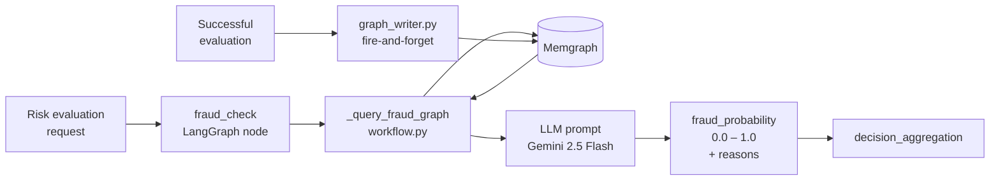
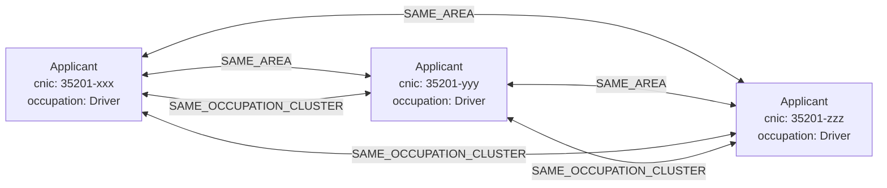
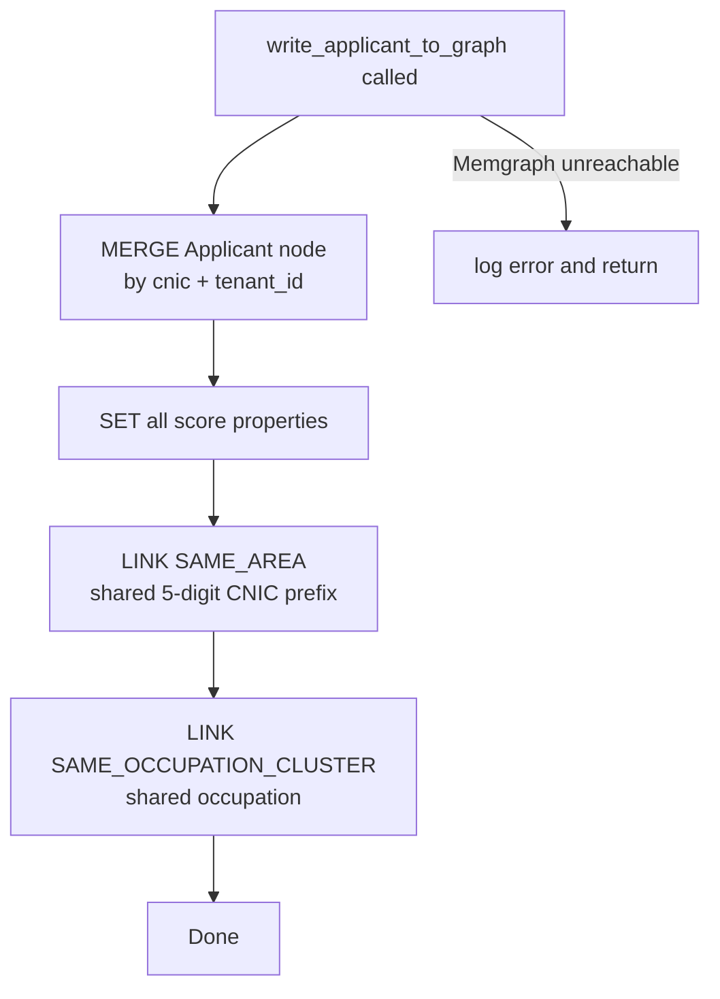

# Fraud Detection Layer

The fraud detection layer is a purpose-built graph intelligence system that sits inside the **Risk Engine**. It combines a **Memgraph graph database** (relationship detection) with **Google Gemini 2.5 Flash** (probabilistic scoring) to catch coordinated fraud rings that purely statistical models miss.

---

## How it works — overview



Every evaluation both **reads from** and **writes to** Memgraph. Each new applicant enriches the graph, so fraud ring signals get stronger over time as the platform sees more applications.

---

## Graph schema

### Nodes

Only one node type exists in the fraud graph:

**`Applicant`**

| Property | Type | Description |
|---|---|---|
| `cnic` | string | Pakistani NIC — part of the composite unique key |
| `tenant_id` | string | Tenant isolation — queries never cross tenant boundaries |
| `occupation` | string | Used to build occupation clusters |
| `declared_income` | float | Used for income-outlier detection |
| `coverage_amount` | float | Used for coverage-cluster detection |
| `medical_score` | int | Score from the last evaluation |
| `financial_score` | int | Score from the last evaluation |
| `fraud_probability` | float | Probability from the last evaluation |
| `evaluated_at` | ISO datetime | Timestamp of the last evaluation |

### Relationships

All relationships are **bidirectional** and **tenant-scoped** — both sides must share the same `tenant_id`.

| Relationship | Between | Created when |
|---|---|---|
| `SAME_AREA` | `Applicant ↔ Applicant` | Both share the same **5-digit CNIC prefix** (same geographic registration area) |
| `SAME_OCCUPATION_CLUSTER` | `Applicant ↔ Applicant` | Both have the same `occupation` value |



---

## Writing to the graph — `graph_writer.py`

`graph_writer.py` is called **fire-and-forget** after every successful evaluation — on both the sync HTTP path (`main.py`) and the async Kafka consumer path (`consumer.py`). Failures are logged and swallowed so a Memgraph outage never blocks or crashes an evaluation.

### What it does



It uses `MERGE` (not `CREATE`) so re-evaluating the same CNIC within a tenant updates the node in place rather than creating duplicates.

### Cypher — node upsert

```cypher
MERGE (a:Applicant {cnic: $cnic, tenant_id: $tenant_id})
SET a.occupation        = $occupation,
    a.declared_income   = $declared_income,
    a.coverage_amount   = $coverage_amount,
    a.medical_score     = $medical_score,
    a.financial_score   = $financial_score,
    a.fraud_probability = $fraud_probability,
    a.evaluated_at      = $evaluated_at
```

### Cypher — SAME_AREA links

```cypher
MATCH (a:Applicant {cnic: $cnic, tenant_id: $tenant_id})
MATCH (b:Applicant)
WHERE b.cnic <> a.cnic
  AND b.tenant_id = a.tenant_id
  AND left(b.cnic, 5) = left($cnic, 5)
MERGE (a)-[:SAME_AREA]->(b)
MERGE (b)-[:SAME_AREA]->(a)
```

### Cypher — SAME_OCCUPATION_CLUSTER links

```cypher
MATCH (a:Applicant {cnic: $cnic, tenant_id: $tenant_id})
MATCH (b:Applicant)
WHERE b.cnic <> a.cnic
  AND b.tenant_id = a.tenant_id
  AND b.occupation = a.occupation
MERGE (a)-[:SAME_OCCUPATION_CLUSTER]->(b)
MERGE (b)-[:SAME_OCCUPATION_CLUSTER]->(a)
```

---

## Reading from the graph — `fraud_check` node

When the LangGraph workflow reaches `fraud_check`, it runs two read queries against the graph and feeds the results to Gemini.

### Query 1 — Income outlier detection

Finds applicants whose declared income is more than **3× the average** of their neighbours who share both area and occupation — a classic sign of a coordinator supplying a fabricated salary figure.

```cypher
MATCH (a:Applicant {cnic: $cnic, tenant_id: $tenant_id})
OPTIONAL MATCH (a)-[:SAME_AREA]->(neighbour:Applicant)-[:SAME_OCCUPATION_CLUSTER]->(a)
WITH a, collect(neighbour) AS neighbours, avg(neighbour.declared_income) AS avg_income
RETURN
  size(neighbours)                                        AS cluster_size,
  avg_income                                              AS avg_income_in_cluster,
  CASE
    WHEN avg_income > 0 AND a.declared_income > avg_income * 3 THEN true
    ELSE false
  END                                                     AS income_outlier,
  left(a.cnic, 5)                                         AS cnic_prefix
```

**Returns:** `cluster_size`, `avg_income_in_cluster`, `income_outlier` (bool)

### Query 2 — Coverage cluster detection

Finds occupation-cluster peers applying for coverage amounts within **±50,000 PKR** of the current request — a sign of coordinated high-value applications through a shared fraud network.

```cypher
MATCH (a:Applicant {cnic: $cnic, tenant_id: $tenant_id})
OPTIONAL MATCH (a)-[:SAME_OCCUPATION_CLUSTER]->(peer:Applicant)
WHERE abs(peer.coverage_amount - a.coverage_amount) < 50000
WITH collect(peer) AS cluster
RETURN size(cluster) AS coverage_cluster_size
```

**Returns:** `coverage_cluster_size`

---

## LLM evaluation — two-tier signal hierarchy

The graph results are formatted into a text block and passed to Gemini 2.5 Flash with a structured output schema (`FraudScoreOutput`). The LLM is instructed to weight signals in two tiers:

### Tier 1 — Graph signals (hard evidence, highest weight)

| Signal | Meaning |
|---|---|
| `income_outlier = true` | Declared income exceeds 3× the area+occupation cluster average — income fabrication ring |
| `coverage_cluster_size > 0` | Occupation peers applying for near-identical coverage — coordinated applications |
| `cluster_size` large | Dense area/occupation cluster amplifies all ring signals |

### Tier 2 — Data signals (circumstantial, secondary weight)

| Signal | Meaning |
|---|---|
| Coverage-to-income ratio > 15× | Moral hazard / over-insurance |
| Age–occupation–income inconsistency | e.g. a 25-year-old "retired" applicant |
| Unusually round income figures | Common in fabricated salary documents |

If the graph is unavailable (`graph_available = false`), the LLM is instructed to assess from Tier 2 signals only and cap `fraud_probability` at **0.5** — absence of graph evidence is not proof of fraud.

### Output schema

```python
class FraudScoreOutput(BaseModel):
    fraud_probability: float  # 0.0 (clean) → 1.0 (certain fraud)
    fraud_reasons: List[str]  # specific, evidence-backed reasons
```

---

## Tenant isolation

Every Memgraph query is scoped to a single tenant via `tenant_id`:

- **Node creation:** `MERGE (a:Applicant {cnic: $cnic, tenant_id: $tenant_id})`
- **Relationship creation:** both `MATCH` sides include `tenant_id = a.tenant_id`
- **Read queries:** `MATCH (a:Applicant {cnic: $cnic, tenant_id: $tenant_id})`

Applicants from different insurance companies (tenants) are **never linked** and their graph signals never influence each other's fraud scores.

---

## Fallback behaviour

If Memgraph is unreachable at query time, `_query_fraud_graph` returns a fallback dict with empty signals:

```python
_GRAPH_FALLBACK = {
    "graph_available":        False,
    "cluster_size":           0,
    "avg_income_in_cluster":  0.0,
    "income_outlier":         False,
    "coverage_cluster_size":  0,
}
```

The LLM is informed that `graph_available = false` and caps fraud probability at 0.5. The rest of the LangGraph workflow continues unaffected.

---

## Exploring the graph — Memgraph Lab (`http://localhost:3001`)

```cypher
-- All applicants ordered by fraud probability
MATCH (a:Applicant)
RETURN a.cnic, a.tenant_id, a.fraud_probability, a.occupation, a.declared_income
ORDER BY a.fraud_probability DESC;

-- Income outliers in their clusters
MATCH (a:Applicant)-[:SAME_AREA]->(n:Applicant)-[:SAME_OCCUPATION_CLUSTER]->(a)
WITH a, avg(n.declared_income) AS cluster_avg
WHERE cluster_avg > 0 AND a.declared_income > cluster_avg * 3
RETURN a.cnic, a.declared_income, cluster_avg,
       round(a.declared_income / cluster_avg * 10) / 10 AS income_ratio
ORDER BY income_ratio DESC;

-- Coverage clusters — same-occupation peers with near-identical coverage
MATCH (a:Applicant)-[:SAME_OCCUPATION_CLUSTER]->(peer:Applicant)
WHERE abs(peer.coverage_amount - a.coverage_amount) < 50000
RETURN a.cnic, a.coverage_amount, collect(peer.cnic) AS cluster_peers
ORDER BY size(cluster_peers) DESC;

-- Full neighbourhood of a specific applicant
MATCH (a:Applicant {cnic: "3520112345671"})
OPTIONAL MATCH (a)-[r]-(b:Applicant)
RETURN a, r, b;
```
