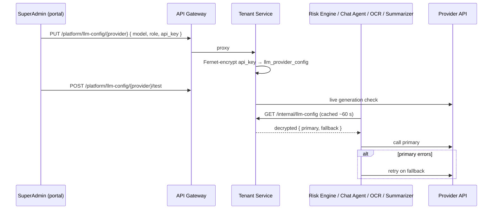

# LLM Providers & Token Usage

## Runtime provider configuration

Every LLM-using service — **Risk Engine, Chat Agent, OCR Engine, Text Summarizer** — resolves its model at runtime instead of hard-coding one. A SuperAdmin picks a **primary** and an optional **fallback** provider in the web portal (**Super Admin → LLM Configuration**, `/super-admin/llm-config`).

| Provider | Default model |
|---|---|
| `gemini` | `gemini-2.5-flash` (`GEMINI_MODEL`) |
| `openai` | `gpt-4o-mini` (`OPENAI_FALLBACK_MODEL`) |
| `anthropic` | `claude-sonnet-4-5` |

Each provider row has a role: `primary`, `fallback`, or `disabled`.

### Endpoints

| Method | Path | Who | Description |
|---|---|---|---|
| `GET` | `/platform/llm-config` | SuperAdmin | Providers and status (keys never returned) |
| `PUT` | `/platform/llm-config/{provider}` | SuperAdmin | Set model, role, API key |
| `POST` | `/platform/llm-config/{provider}/test` | SuperAdmin | Live key check (real generation) |
| `GET` | `/internal/llm-config` | Services only | Decrypted primary + fallback — **not** exposed through the gateway; guarded by `X-Internal-Secret` when `INTERNAL_API_SECRET` is set |

### Env-var fallback

If no provider is configured, the config endpoint is unreachable, or it returns nothing, services fall back to environment variables — so a deployment that never opens the SuperAdmin screen still works:

| Variable | Purpose |
|---|---|
| `GEMINI_API_KEY`, `GEMINI_MODEL` | Gemini primary |
| `OPENAI_API_KEY`, `OPENAI_FALLBACK_MODEL` | OpenAI fallback |
| `ANTHROPIC_API_KEY`, `ANTHROPIC_FALLBACK_MODEL` | Anthropic fallback |
| `CONFIG_ENCRYPTION_KEY` | Fernet key used to encrypt stored API keys (tenant-service) |
| `INTERNAL_API_SECRET` | Optional shared secret for `/internal/llm-config` |

### Storage — `llm_provider_config`

| Column | Notes |
|---|---|
| `provider` | `gemini` / `openai` / `anthropic` (unique) |
| `model_name` | Model id |
| `role` | `primary` / `fallback` / `disabled` |
| `api_key_encrypted` | Fernet ciphertext (`crypto_utils.py`) |
| `updated_at`, `updated_by` | Audit |

## Token usage ("Token Economy")

Every LLM call reports its usage fire-and-forget to `POST /tokens/usage` — a metering outage never blocks a request. The **Super Admin → Tokens** page (`/super-admin/tokens`) reads `GET /tokens/usage`, aggregated by date and service.

### `token_usage` table

| Column | Notes |
|---|---|
| `service_name` | `Risk Engine`, `OCR Engine`, `Text Summarizer`, `Chat Agent`, `Chat Agent — Plan Advisor` |
| `input_tokens`, `output_tokens`, `total_tokens`, `cached_tokens` | |
| `tenant_id` | Nullable — tenant that triggered the call |
| `model_name` | Model actually used (primary or fallback) |
| `thread_id` | Chat thread, when the caller is the copilot |
| `created_at` | Indexed for date aggregation |

## Troubleshooting

- **Which model is live?** Open `/super-admin/llm-config`, or call `GET /internal/llm-config` from inside the Docker network.
- **Is the primary provider the problem?** Use the **Test** button (`POST /platform/llm-config/{provider}/test`) — it performs a real generation.
- Config changes take effect within ~60 s (the per-service cache), without a restart.
