# Underwriting & Policy Lifecycle

This page walks a policy from lead to claim and names the router that owns each step. All routes are under `/tenants/{tenant_id}` and reach the Tenant Service through the API Gateway.

```mermaid
flowchart LR
    L[Lead / Customer] --> Q[Quote]
    Q --> C[Underwriting Case]
    C --> G[Pre-underwriting gates]
    G --> R[Requirements Engine]
    R --> AI[AI risk assessment]
    AI --> PU[Post-underwriting<br/>counter-offer · reinsurance]
    PU --> A[Stage A<br/>pre-issuance]
    A --> I[Issue + first premium]
    I --> B[Stage B<br/>in-force servicing]
    B --> CL[Claims]
```

## 1. Leads, groups and quotes

| Step | Where | Notes |
|---|---|---|
| Individual customer | `customers.py` | Per-tenant CNIC uniqueness; publishes `CustomerCreated` → gateway `quote_worker` prices every eligible plan |
| Family group | `families.py` | Floater and life-bundle family policies; member validate → confirm |
| Corporate group | `organizations.py` | Master policies and employee census validate → confirm (group life) |
| Products | `insurance_plans.py` | Per-tenant plan catalogue and rate tables (`POST /insurance-plans/seed-defaults` loads the standard set) |
| Lead sources | `acquisition_sources.py` | |
| Instant quote | Gateway `POST /quote`, `GET/PATCH /quotes` | Deterministic, `shared/pricing/calculator.py`; no LLM |
| Plan suggestion | Gateway `POST /suggest-plan` | LLM recommendation via Risk Engine |

## 2. Pre-underwriting gates

A case collects six clearance gates before AI underwriting:

| Gate | Router | Summary |
|---|---|---|
| **E-Application** | `e_application.py` | Customer's own medical/lifestyle/family-history/existing-insurance disclosure and signed declaration, via a single-use hashed expiring link (`/public/e-application/{token}`, no login). Staff: `invite`, `verify`, `custom-questions`. Submitting publishes a live [case event](/data-flow#live-case-events-sse). |
| **Agent's Confidential Report** | `agent_confidential_report.py` | Selling agent's moral-hazard, financial-standing and lifestyle observations (`GET/PUT /acr`, `/acr/submit`) |
| **PEP / sanctions compliance** | `cases.py` `POST /cases/{id}/compliance/run` | Screening (OpenSanctions when `OPENSANCTIONS_API_KEY` is set) |
| **Initial Premium Payment** | `initial_premium_payment.py` | "No premium, no risk" (Insurance Ordinance 2000 s.30) — first premium collected at proposal, priced from the case's `PremiumQuote` (mock payment gateway) |
| **Insurance history** | `insurance_history.py` | Over-insurance against Human Life Value, replacement/churning, non-disclosure; underwriter `clear`/`fail` override |
| **Medical exam** | `medical_exam.py` | Above the Non-Medical Limit: `assess` resolves the test panel and budget, `invite` issues a booking link (`/public/medical-exam/{token}`), customer or staff books a panel clinic slot, then `result` or `waive` |

## 3. Requirements Engine → AI underwriting

`POST /cases/{id}/requirements/determine` (`shared/underwriting/requirements_rules.py`) computes the case's mandatory requirements from age, coverage, coverage-to-income, smoker status, BMI and declared conditions. If any required item is not `Satisfied`/`Waived`, the case moves to `Pending Documents` and the Risk Engine is **never called**. Otherwise the gateway fetches the evidence bundle (`/underwriting/evidence`) and runs the [LangGraph workflow](/data-flow#langgraph-workflow-risk-engine-internals). Details: [Case Management](/cases#requirements-engine--caseworkflow).

## 4. Post-underwriting

| Step | Router | Summary |
|---|---|---|
| Counter-offer | `pre_issuance.py` `/policies/{pid}/counter-offer` (+ `accept` / `decline`) | Revised terms (e.g. loading) the customer must accept |
| Facultative reinsurance | `reinsurance.py` | Split sum assured into retained / treaty / facultative; `refer` parks the policy at `ReinsurerReferred`; `response` records terms; `apply` writes them onto the contract; `withdraw` |

## 5. Stage A — pre-issuance

`GET /policies/{pid}/pre-issuance` returns a six-step readiness checklist, and `POST /policies/{pid}/issue` hard-gates on the same rules:

1. Accept revised terms (counter-offer)
2. Clear requirements — `/policies/{pid}/requirements`, `/requirements/{id}/{submit,verify,waive}`
3. Collect first premium — `policies.py` `/payments/initiate` → `/payments/confirm`
4. Compliance — `/policies/{pid}/compliance/run`, `/compliance/{id}/{clear,fail}`
5. Beneficiaries — `PUT /beneficiaries` (shares must total 100), with history
6. Documents — `/documents/generate` (real PDFs), download

`GET /policies/{pid}/issuance-preview` gathers everything the issuance review screen needs in one call.

## 6. Stage B — in-force servicing (`post_issuance.py`)

| Area | Routes |
|---|---|
| Free-look | `GET /free-look`, `POST /free-look/cancel` (full refund while the window is open; clock anchored on delivery) |
| Onboarding | `/onboarding/{policyholder-id, welcome-kit, portal, contact, send-welcome, acknowledge}` |
| Premiums | `/premiums` schedule, `collect`, `bulk-collect`, `remind`, `waive`, `monitor`, `autopay`, `restructure`, `lapse-warning`, reminders and receipts |
| Endorsements | `/endorsements/{nominees, address, sum-assured, riders, contact}`, `quote`, document download, email |
| Renewal / exit | `policies.py` `/renew`, `/lapse`, `/cancel`, `GET /policies/renewals/upcoming` |

## Policy state machine

Every status change goes through `shared/services/policy_state_machine.apply_transition()`, which rejects illegal moves (`IllegalStateTransition`) and appends an immutable `PolicyEvent` (the audit trail, `GET /policies/{pid}/events`). After commit, routers publish a `PolicyLifecycleEvent` to `insurance.policy.lifecycle.v1`.

| From | Allowed next states |
|---|---|
| `Quoted` | Proposed, InformationRequested, Declined |
| `Proposed` | UnderReview, InformationRequested, CounterOffer, Approved, AcceptedWithLoadings, Declined, Quoted |
| `UnderReview` | InformationRequested, CounterOffer, Approved, AcceptedWithLoadings, Declined, Postponed, ReinsurerReferred, Proposed |
| `InformationRequested` | Proposed, UnderReview, CounterOffer, Approved, AcceptedWithLoadings, ReinsurerReferred, Declined |
| `ReinsurerReferred` | Approved, AcceptedWithLoadings, CounterOffer, Postponed, Declined, UnderReview |
| `Postponed` | UnderReview, Declined |
| `CounterOffer` | Approved, AcceptedWithLoadings, NotTakenUp, Declined |
| `Approved` | PendingPayment, Issued, CounterOffer, ReinsurerReferred, Declined, Cancelled |
| `AcceptedWithLoadings` | PendingPayment, Approved, Issued, CounterOffer, ReinsurerReferred, Declined, Cancelled |
| `Issued` | PendingPayment, Active, Cancelled |
| `PendingPayment` | Active, Cancelled, NotTakenUp |
| `Active` | Active (renewal), GracePeriod, Lapsed, Cancelled |
| `GracePeriod` | Active, Lapsed, Cancelled |
| `Lapsed` | Active (reinstatement) |
| `Declined` | UnderReview, Approved, AcceptedWithLoadings (underwriter override) |

The grace period length comes from `GRACE_PERIOD_DAYS` (default 30).

## 7. Claims (`claims.py`)

FNOL → triage → investigation → adjudication → payout, with reinsurance recovery and contestability re-underwriting.

| Route | Purpose |
|---|---|
| `POST/GET /claims`, `GET /claims/{id}` | Register (FNOL) and list |
| `PATCH /claims/{id}/status` | Status transitions |
| `POST /claims/{id}/adjudicate` | Rule-engine adjudication |
| `POST /claims/{id}/payout` | Disbursement |
| `POST /claims/{id}/reinsurance-refer` | Reinsurance recovery |
| `POST /claims/{id}/re-underwrite` · `/resolve-underwriting` | Contestability referral back to underwriting |
| `POST/GET /claims/{id}/artifacts` | Claim documents |

Claim statuses: `New`, `Triaged`, `Under Investigation`, `Pending Documents`, `Approved`, `Partial Approval`, `Declined`, `Referred to Manager`, `Reinsurance Referred`, `Re-Underwriting Required`, `Settled`, `Closed`.

The copilot can drive the whole claim end-to-end — see the [claims journey](/chat-agent#autonomous-journeys).

## Configurable rule engine (`rules.py`)

A tenant-editable hierarchy — **Category → SubCategory → EligibilityProfile → RuleSet → RuleVersion → Rule → RuleCriteria** — with versioned rule sets (`PATCH /rules/versions/{id}/status`), live evaluation by rule-set code (`POST /rules/evaluate`) or by category/subcategory/channel scope (`POST /rules/evaluate-scope`), and an evaluation audit log (`GET /rules/logs`). Managed in the portal at `/admin/rule-engine`.
